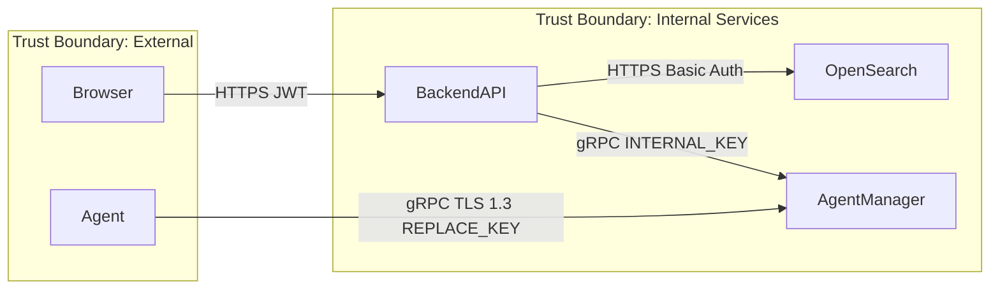

# Threat Modeling

Design-time security analysis following Adam Shostack's four questions:

1. **What are we working on?**
2. **What can go wrong?**
3. **What are we going to do about it?**
4. **Did we do a good job?**

## When to Threat Model

Trigger whenever a change introduces, moves, or alters what crosses a trust boundary:
- Auth flows and token handling
- Payment or financial data flows
- Multi-tenant data isolation
- AI/LLM features (prompt injection surface)
- New external API integrations

## Data Flow Diagrams (DFD)

Three levels: context → major processes → detailed components.

Most valuable element: **trust boundaries** — every crossing is a place data is validated, authenticated, or filtered.



## STRIDE Analysis

Each DFD element evaluated across six threat categories:

| Letter | Threat | Violated Property | HiveArmor Example |
|--------|--------|------------------|-------------------|
| S | Spoofing | Authentication | Forged JWT token |
| T | Tampering | Integrity | Alert status manipulation |
| R | Repudiation | Non-repudiation | Denying alert acknowledgment |
| I | Information Disclosure | Confidentiality | OpenSearch index leak via CORS |
| D | Denial of Service | Availability | Event processor overload |
| E | Elevation of Privilege | Authorization | Missing @PreAuthorize on admin endpoint |

## Abuse Cases

Complement STRIDE with business-intent violations:

Format: *"As a malicious actor, I want to [goal] so that I can [outcome]."*

Examples for HiveArmor:
- "As a malicious actor, I want to suppress alerts for my C2 traffic so that SOC analysts don't see my lateral movement"
- "As a malicious actor, I want to create a backdoor API key so that I maintain persistent access after credential rotation"
- "As a malicious actor, I want to exfiltrate alert data to map the organization's security coverage"

## Mitigations

Four responses per threat: **Mitigate, Transfer, Accept, or Avoid**

Specificity matters:
- ❌ "Add rate limiting"
- ✅ "Add rate limiting on `/api/authenticate`: 10 attempts per minute per IP, 429 response with `Retry-After` header, locked for 15 minutes after 20 failures"

"Every High/Critical mitigation should have a test. If you can't write the test, you don't have the mitigation, you have an intention."

## HiveArmor-Specific STRIDE Assessment

| Component | Key Threats | Current Mitigations |
|-----------|-------------|---------------------|
| JWT auth | Spoofing (SEC-02: key rotates on restart) | DEBT-14 open |
| OpenSearch API | Information Disclosure | Basic auth via env vars |
| Agent gRPC | Spoofing | TLS 1.3 + REPLACE_KEY ldflags |
| CORS config | Information Disclosure | SEC-03: wildcard in prod (open) |
| Admin endpoints | Elevation of Privilege | @PreAuthorize required per AGENTS.md |

## Output Template

```markdown
# Threat Model: [Component/Feature Name]
**Date:** [ISO date]
**Author:** [name]
**Scope:** [What system/change is being modeled]

## DFD Summary
[Mermaid diagram or description of data flows and trust boundaries]

## STRIDE Findings
| ID | Element | Threat | Mitigation | Priority |
|----|---------|--------|------------|----------|

## Abuse Cases
| ID | Actor | Goal | Outcome |

## Recommended Mitigations
| Priority | Control | Owner | Due |
```
