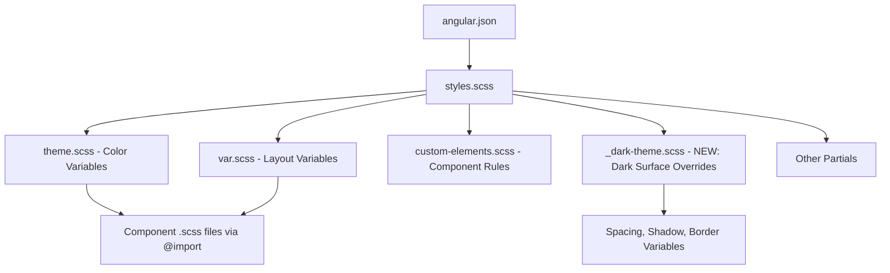

# Design Document: Angular UI Refresh

## Overview

This design describes a pure SCSS refactoring of the UTMStack Angular 7 frontend to modernize its visual appearance from a light-themed interface to a cohesive dark-mode design. The refresh targets color palette, typography, spacing, borders, shadows, interactive states, and scrollbars — all achieved exclusively through SCSS changes.

**Key Constraints:**
- Zero TypeScript, HTML, or dependency changes
- Must compile with `node-sass@4` (Node 14.16.1, Angular CLI 7.3.6)
- No `@use`, `@forward`, or `math.div()` — only `@import` and `/` division
- All existing SCSS variable names must be preserved
- No CSS class names removed or renamed

**Approach:** Modify the existing `theme.scss` file to redefine color values (keeping the same variable names), introduce a new `_dark-theme.scss` partial imported via `@import` in `styles.scss`, and update global style rules in `styles.scss` and `custom-elements.scss` to apply dark surfaces, refined spacing, border radius, shadows, and interactive states.

## Architecture

The SCSS architecture follows the existing file organization with minimal additions:



### File Responsibilities

| File | Role | Changes |
|------|------|---------|
| `theme.scss` | Color variable definitions | Update values for `$primary-color`, semantic colors, add dark surface variables |
| `var.scss` | Layout dimensions, breakpoints | Add spacing scale, border-radius, shadow variables |
| `_dark-theme.scss` | **New partial** — dark surface overrides | Dark body/card/input/table backgrounds, text colors |
| `custom-elements.scss` | Component-level style rules | Update hardcoded colors to use variables |
| `styles.scss` | Global styles + imports | Import `_dark-theme`, update body/element styles |
| Component `.scss` files | Individual component styles | Minimal changes — replace hardcoded `#FFFFFF` backgrounds |

### Design Decision: Single New Partial vs. Multiple Files

**Decision:** Introduce one new partial (`_dark-theme.scss`) rather than scattering dark-mode overrides across many files.

**Rationale:**
- Keeps all surface/text color overrides in one discoverable location
- Existing component `.scss` files already reference `$primary-color` etc. via `@import "../theme"` — updating variable values propagates automatically
- Minimizes the blast radius of changes
- The new partial is imported last in `styles.scss` so its rules take precedence

## Components and Interfaces

This feature has no TypeScript components or interfaces. The "components" are SCSS partials and their relationships.

### SCSS Variable Interface (theme.scss)

These are the existing variables that will have their values updated (names preserved):

```scss
// Primary palette — value changes, name stays
$primary-color: #3B82F6;         // Was #232f3e (dark navy) → vibrant blue
$primary-color-hover: #2563EB;   // Was #1a202f → darker blue
$blue-scroll: #3B82F6;           // Was #0277bd → matches primary
$blue-component: #60A5FA;        // Was #0277bd → lighter blue for components
$active: #3B82F6;                // Was #0a6ebd → matches primary

// Semantic colors — value changes
$success-color: #10B981;         // Was #4caf50 → modern emerald
$danger-color: #EF4444;          // Was #f44336 → modern red
$info-color: #F59E0B;            // Was #FF9800 → amber
$grey-color: #64748B;            // Was #888 → slate grey
$white-color: #F1F5F9;           // Was #f1f1f1 → slightly blue-tinted

// Surface & text — new additions (dark mode)
$surface-ground: #0F172A;        // Deepest background (body)
$surface-primary: #1E293B;       // Cards, panels
$surface-secondary: #334155;     // Elevated cards, inputs
$surface-elevated: #475569;      // Modals, dropdowns, popovers

$text-primary: #E2E8F0;          // Main text
$text-secondary: #94A3B8;        // Muted/secondary text
$text-tertiary: #64748B;         // Disabled/hint text

// Border
$border-color-dark: #334155;     // Subtle borders on dark backgrounds
$border-radius-base: 6px;        // Consistent radius

// Severity colors (new, for consistent alert severity)
$severity-critical: #DC2626;
$severity-high: #F97316;
$severity-medium: #FBBF24;
$severity-low: #3B82F6;
$severity-info: #6B7280;
```

### SCSS Variable Interface (var.scss additions)

```scss
// Spacing scale (4px base)
$space-1: 4px;
$space-2: 8px;
$space-3: 12px;
$space-4: 16px;
$space-6: 24px;
$space-8: 32px;
$space-12: 48px;

// Shadow elevation levels
$shadow-low: 0 1px 3px rgba(0, 0, 0, 0.3), 0 1px 2px rgba(0, 0, 0, 0.2);
$shadow-medium: 0 4px 6px rgba(0, 0, 0, 0.35), 0 2px 4px rgba(0, 0, 0, 0.2);
$shadow-high: 0 10px 20px rgba(0, 0, 0, 0.4), 0 4px 8px rgba(0, 0, 0, 0.3);

// Border radius
$radius-sm: 4px;
$radius-base: 6px;
$radius-lg: 8px;
$radius-pill: 9999px;
```

### New Partial: `_dark-theme.scss`

This file contains dark surface overrides applied globally:

```scss
@import "./theme";
@import "./var";

// Body
body {
  background: $surface-ground;
  color: $text-primary;
}

// Cards
.card {
  background-color: $surface-primary;
  border: 1px solid $border-color-dark;
  border-radius: $radius-base;
  box-shadow: $shadow-low;

  .card-header {
    background-color: $surface-primary;
    border-bottom: 1px solid $border-color-dark;
    border-radius: $radius-base $radius-base 0 0;
    padding: $space-4;
  }

  .card-body {
    padding: $space-4;
  }
}

// Modals
.modal-content {
  background-color: $surface-primary;
  border: 1px solid $border-color-dark;
  border-radius: $radius-base;
  box-shadow: $shadow-high;
}

// Form inputs
.form-control {
  background-color: $surface-secondary;
  border: 1px solid $border-color-dark;
  color: $text-primary;
  border-radius: $radius-base;
}

// Tables
table tbody tr:nth-child(even) {
  background-color: rgba(30, 41, 59, 0.5);
}

table tbody tr:nth-child(odd) {
  background-color: $surface-primary;
}

// Text
p, span, label {
  color: $text-primary;
}
```

## Data Models

This feature has no data models. It is purely a visual/cosmetic change limited to SCSS variable definitions and style rules. No data structures, API contracts, or state objects are created or modified.

The "data" in this context is the set of SCSS variables and their values, which are documented in the Components and Interfaces section above.

## Error Handling

Since this feature modifies only SCSS files, traditional runtime error handling does not apply. However, the following failure modes must be addressed:

### SCSS Compilation Errors

| Error Type | Prevention Strategy |
|------------|-------------------|
| Undefined variable reference | All new variables defined in `theme.scss` or `var.scss` before use in `_dark-theme.scss` |
| `node-sass@4` incompatibility | No `@use`, `@forward`, `math.div()`, or module system features |
| Circular imports | `_dark-theme.scss` imports `theme` and `var` only; no circular chains |
| Division ambiguity | Use `#{$value / 2}` interpolation for division, not bare `/` in property values where ambiguous |
| Missing partial | `_dark-theme.scss` uses `_` prefix naming convention and is imported via `@import "assets/styles/dark-theme"` |

### Build Budget Violations

The production build has a 15MB maximum error threshold. Pure SCSS changes produce minimal output size increase (a few KB at most for additional CSS rules). This is not a risk, but should be verified after implementation.

### Visual Regression Risks

| Risk | Mitigation |
|------|-----------|
| Hardcoded `#FFFFFF` in component `.scss` files | Search-and-replace with `$surface-primary` variable |
| `!important` overrides fighting new dark styles | New dark-theme rules use sufficient specificity; avoid adding more `!important` |
| Third-party CSS (Bootstrap, ng-select) rendering white | Override via `.ng-select-container` and Bootstrap utility selectors in `_dark-theme.scss` |
| Print styles broken | `@media print` block keeps `background-color: white` for print context |

## Testing Strategy

### Why Property-Based Testing Does NOT Apply

This feature consists exclusively of SCSS variable and rule changes. There are no functions, algorithms, parsers, serializers, or business logic to test. PBT requires "for all inputs X, property P(X) holds" — but SCSS produces a static CSS output with no runtime input variation. The appropriate testing strategy is:

- **Build verification** (compilation passes)
- **Visual regression testing** (screenshots before/after)
- **Manual review** (dark surfaces applied consistently)

### Testing Approach

#### 1. Build Compilation Test (Automated — CI)

```bash
cd frontend
npm install
NODE_OPTIONS=--max_old_space_size=8192 npm run build
```

**Pass criteria:** Exit code 0, no SCSS compilation errors, output within 15MB budget.

#### 2. Lint Verification (Automated — CI)

```bash
cd frontend
npm run lint
```

**Pass criteria:** No new lint errors introduced (TSLint checks TS/HTML only, so this is a safety net).

#### 3. Visual Regression Checklist (Manual)

| Area | Verification |
|------|-------------|
| Body background | Dark `$surface-ground` color, no white flash |
| Card components | `$surface-primary` background, border radius, subtle shadow |
| Modal dialogs | Dark background, high shadow elevation, rounded corners |
| Form inputs | Dark input fields, light text, accent-colored focus ring |
| Tables | Alternating dark row colors, no white stripes |
| Navigation header | Retains existing dark color (was already `$primary-color`) |
| Buttons | Hover state visible, accent color consistent |
| Scrollbars | Dark track, slightly lighter thumb, 8px width |
| Severity badges | Critical=red, High=orange, Medium=yellow, Low=blue, Info=grey |
| Typography | 14px base, heading hierarchy, monospace for code/logs |
| Spacing | Consistent card padding, table cell padding, form gaps |

#### 4. Cross-Browser Verification (Manual)

- Chrome (latest) — primary target
- Firefox (latest) — verify WebKit scrollbar styles gracefully degrade
- Edge (Chromium) — same rendering as Chrome

#### 5. WCAG Contrast Verification

Verify the following color combinations meet 4.5:1 contrast ratio:

| Foreground | Background | Expected Ratio |
|-----------|------------|---------------|
| `$text-primary` (#E2E8F0) | `$surface-ground` (#0F172A) | ~14:1 ✓ |
| `$text-primary` (#E2E8F0) | `$surface-primary` (#1E293B) | ~10:1 ✓ |
| `$text-secondary` (#94A3B8) | `$surface-ground` (#0F172A) | ~6.5:1 ✓ |
| `$primary-color` (#3B82F6) | `$surface-ground` (#0F172A) | ~5.5:1 ✓ |
| `$primary-color` (#3B82F6) | `$surface-primary` (#1E293B) | ~4.5:1 ✓ |

### File Change Summary

| File | Type of Change |
|------|---------------|
| `frontend/src/assets/styles/theme.scss` | Update color variable values, add surface/text/severity variables |
| `frontend/src/assets/styles/var.scss` | Add spacing scale, shadow, border-radius variables |
| `frontend/src/assets/styles/_dark-theme.scss` | **New file** — dark surface overrides for body, card, modal, input, table |
| `frontend/src/assets/styles/custom-elements.scss` | Replace hardcoded colors with variables, update table/nav/card rules |
| `frontend/src/styles.scss` | Add `@import "assets/styles/dark-theme"`, update body/scrollbar/typography |
| Component `.scss` files (~10-15 files) | Replace hardcoded `#FFFFFF`/`white` backgrounds with `$surface-primary` |

