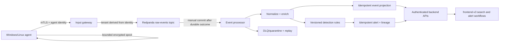

# Production-minimum SIEM backend plan

Created: **2026-08-14 11:26:51 IST (UTC+05:30)**  
Repository baseline: `main` at `b749b485b45644e40cf0c27dc516d86b7fd9887e`  
Program status: **PLANNED — implementation has not started**

## Outcome

Deliver one production-shaped, single-node HiveArmor pilot that can be installed on a clean testing server, enroll real Windows and Linux agents, retain events during temporary network or service outages, normalize and process authentic endpoint telemetry, evaluate versioned detection rules, persist alerts with source-event lineage, and expose the resulting events and alerts through the authenticated `frontend-v3` experience.

This milestone is a controlled pilot release. It is not a claim of multi-node high availability, disaster-proof production operation, or full feature parity with every redesigned page.

## Definition of the minimum product

### Included

- One documented Linux server installation using a canonical, version-pinned Docker Compose production profile.
- `frontend-v3`, backend, PostgreSQL, OpenSearch, Redpanda, agent-manager, input gateway and event-processor manager/worker.
- Private internal networks; only the reverse proxy/UI and agent ingestion endpoints are exposed.
- Operator-supplied TLS certificate and private CA support; certificate and hostname verification are mandatory.
- One-time, tenant-bound, expiring enrollment tokens; agent credentials can be rotated and revoked.
- Signed Windows and Linux agent artifacts with checksums and provenance.
- Windows Event Log and PowerShell ETW ingestion; Linux journald/auth/audit and core eBPF process/network events where supported.
- Agent heartbeat, health, queue/spool status, policy/version and last successful delivery.
- Durable raw-event ingress through Redpanda, deterministic normalization, versioned rule evaluation, idempotent event/alert persistence and source-event lineage.
- A small checked-in, tested detection pack covering authentication abuse, PowerShell/script execution, suspicious process execution, persistence and outbound network activity.
- Authenticated alert queue/detail, search/hunt, detection inventory and agent-health operational paths.
- OpenSearch retention/rollover, PostgreSQL backup, OpenSearch snapshot and a proven restore procedure.
- Metrics, structured logs, readiness/liveness, ingestion lag, dropped/retried/DLQ counts and alert-generation latency.
- A raw-log acceptance suite that starts at a real agent or protocol boundary. Direct index writes never establish acceptance.

### Explicitly deferred

- Multi-node high availability and cross-region disaster recovery.
- macOS distribution until Apple signing/notarization and ESF entitlement are proven in release automation.
- Autonomous AI decisions, rule publishing or disruptive response.
- Production SOAR execution, connector marketplace breadth and advanced response governance.
- Full UEBA, graph correlation, compliance attestation and every posture workflow.
- General internet-facing Syslog/CEF/LEEF/cloud ingestion; these follow once the secure endpoint path is stable.

## Pilot operating envelope

The first release must publish and verify a bounded capacity envelope instead of claiming unlimited scale:

- 1–100 enrolled endpoints.
- Sustained 1,000 events/second and a measured 5,000 events/second burst for 10 minutes on the reference server.
- At least 24 hours of durable broker retention and configurable 7–30 day hot event retention.
- At least 72 hours of agent-side spool at the documented default collection profile, bounded by disk quota.
- p95 agent-ingress acknowledgement under 2 seconds during nominal load.
- p95 normalized event searchable under 10 seconds and qualifying alert visible under 30 seconds.
- Zero acknowledged-event loss in broker, processor and OpenSearch restart acceptance scenarios.
- Duplicate delivery may occur, but canonical event and alert IDs make the stored result idempotent.

The reference CPU, RAM, disk, filesystem and observed test results must be published before release. Failure to meet the envelope blocks the pilot tag; the numbers may be revised only with recorded evidence.

## Target data path

## Current implementation reconciliation

### Proven and reusable

- `DET-ING-001` live-proves a raw PowerShell ETW record through normalization, CEL evaluation, real event/alert persistence and authenticated alert projection.
- `DET-ING-002` live-proves three raw records through independent detection and the canonical correlation projection.
- The endpoint agent already collects Windows Event Log, PowerShell ETW, platform logs and several EDR telemetry classes.
- The agent has a local SQLite record of unacknowledged logs, a bounded memory queue, retry scanning and a local dropped-log file.
- The input gateway requires TLS 1.3, authenticates agent/collector streams, returns backpressure errors and publishes to `hivearmor.raw.events` when Kafka is enabled.
- The Kafka consumer manually commits offsets after synchronous event persistence.
- Backend and frontend operational alert/search surfaces already exist in partial, tested states.

### Release-blocking mismatches

1. The input gateway assigns a hard-coded default tenant when tenant metadata is absent. Tenant must be derived from the authenticated connector identity; a producer-supplied tenant cannot broaden scope.
2. Agent registration uses a shared connection key passed on the install command line. Registration has no one-time token, tenant binding, expiry, use count, device proof or approval state.
3. Agent keys are stored and returned in plaintext, synchronized through an unbounded `ListAgents` request, and one delete audit log records the secret.
4. The agent allows `InsecureSkipVerify`, accepts a one-GiB gRPC receive size and has no cryptographic device certificate lifecycle.
5. At the audit baseline the input producer used `RequireOne`, a data-type/source partition key and no schema headers. `PILOT-00` now implements `ha.raw-event.v1`, `acks=all`, `tenantId:dataSource` keys and validated schema/identity headers. Durable receipts, DLQ/replay and agent/source identity binding remain under `PILOT-02`/`PILOT-03`.
6. Malformed Kafka records are published to `hivearmor.raw.events.quarantine` with a redacted reason; the original offset commits only after that write. Persistent write failures still have no retry budget and stay uncommitted.
7. `ProcessLog` queues an asynchronous event write and the Kafka consumer writes the event synchronously again. Alert, finding and compliance writer errors are swallowed or detached in goroutines, so the offset can commit before required derived outputs are durable.
8. OpenSearch writers set `InsecureSkipVerify: true`; alert writes do not enforce successful HTTP status.
9. The local compose and active CI package `frontend-v2`; `frontend-v3` has no production container definition. The legacy installer omits the current Redpanda path, floats PostgreSQL/OpenSearch images and does not inject all current worker secrets/configuration.
10. Several runtime images execute as root, are not digest-pinned and lack production filesystem/capability restrictions.
11. Endpoint collectors now spool to SQLite before the send queue and default retention is 512 MB. `hivearmor-collector` and `as400` can still drop on full memory queues. Live outage/replay is not proven.
12. The inputs README describes the older Unix-socket-only path and a permissive default-tenant behavior; deployment and operator documentation are not an authoritative representation of the current Kafka architecture.

## Implementation sequence

Only one phase may be `IN PROGRESS`. Each phase closes with tests, evidence and timestamped ledger/contract updates.

### Phase 0 — Freeze the pilot contract and release baseline

Status: `CODE COMPLETE` (2026-08-14 11:57:50 IST; live broker acceptance remains in later durability/release gates)

- Declare this backend foundation the active slice and pause new frontend page redesigns.
- Choose one canonical index naming representation without violating the version-locked migration rule; document aliases where current `v3-hive-*` data differs from the AGENTS standard.
- Inventory service/API/topic/database ownership and deprecate, do not silently remove, the legacy direct gRPC/socket and frontend-v2 deployment surfaces.
- Create a versioned event envelope and compatibility policy: schema version, event ID, tenant, source/agent, observed/received time, content type, encoding, trace ID and producer version.
- Add a pilot threat model, data classification and secrets inventory without copying secret values into documentation.
- Capture a green/known-failure baseline for Go, Java, frontend, Compose and raw-ingestion tests.

Exit gate: canonical topology, data envelope, ownership and deprecation table approved; baseline failures documented.

### Phase 1 — Secure enrollment and connector identity

Status: enrollment is `CODE COMPLETE`; identity ingest is `LIVE VERIFIED` for ProcessLog gates (2026-08-18 19:55:01 IST). Packaged-host, collector/cloud-plugin tenant binding and device mTLS remain later gates.

Checkpoint **2026-08-18 19:55:01 IST (UTC+05:30)**: `PILOT-02` live identity/forged-tenant/oversize/rate-limit/revoke and secret-free worker logs passed against rebuilt images. `PILOT-03` quarantine and worker/consumer restart retention passed after fixing kafka-go dual Topic. Packaged-host `PILOT-01`, collector/cloud tenant binding, mTLS, broker outage and agent-process spool remain open.

Checkpoint **2026-08-18 16:59:20 IST (UTC+05:30)**: `PILOT-01` and `PILOT-02` closed as `CODE COMPLETE` on operator instruction. Remaining Windows SCM/Linux systemd and packaged-host role/cross-tenant evidence move to `PILOT-09`. Live identity/forged-tenant/size/rate replay, collector/cloud-plugin tenant binding and device mTLS remain open. The full Java baseline remains red with nine unrelated errors across five classes.

Checkpoint **2026-08-18 13:37:18 IST (UTC+05:30)**: the hash-only enrollment/token and compatibility device-credential subset is implemented under `PILOT-01`, including same-transaction allowlisted audit events, database-enforced append-only mutation rejection, bounded tenant-scoped audit retrieval, authenticated atomic local credential storage, protected credential rotation and authorized post-revocation re-enrollment. Rebuilt services are healthy; live concurrent replay, forged-ID, rotation, revoked-key, replacement reconnect, safe-projection and database-tamper acceptance passed. The local authenticated REST matrix now also passes create/revoke, platform canonicalization, lifetime/page/size bounds and missing/invalid/unknown/unauthenticated tenant behavior with stable RFC problem responses. Linux/Windows amd64/arm64 packages, embedded/external checksums, production fail-closed signing policy and build-provenance publication are implemented and locally inspected. Actual Windows SCM/Linux systemd lifecycle acceptance, authenticated role/cross-tenant packaged-host acceptance, platform keystore/device certificates remain open. Do not read the phase status as completion of the bullets below.

- Add backend-admin APIs for one-time enrollment token create/list/revoke. Store only token hashes; bind tenant, agent policy, platform, expiry, maximum uses and creator audit identity.
- Replace the CLI secret argument with token-file/stdin or protected environment input; redact all auth material from logs and process arguments.
- Agent-manager validates token atomically, records tenant and immutable agent UUID, then issues a short-lived bootstrap identity and device certificate.
- Persist only hashed agent API secrets if compatibility is required; prefer mTLS device certificates for normal streams. Add rotate, revoke, re-enroll and lost-device flows.
- Remove the unbounded plaintext key synchronization API. Input authorization consumes a bounded identity/revocation projection or locally verified certificate claims.
- Derive tenant and agent/source metadata from authenticated identity at ingress. Reject missing, unknown, revoked or conflicting identity; never default to a tenant.
- Add per-tenant/agent rate limits, 4 MiB pilot message cap, connection limits and explicit retry-after behavior.
- Remove agent secret values from delete responses and audit logs.

Exit gate: tenant-crossing, expired/reused token, revoked agent, forged tenant, oversized payload and secret-leak tests pass.

### Phase 2 — Durable collection and ingress

Status: `CODE COMPLETE` (2026-08-18 19:55:01 IST; quarantine and restart retention live; broker outage and agent-process spool remain)

- Make every enabled collector write to the durable local spool before network submission; the memory channel contains references, not the sole copy.
- Use bounded disk quotas, pressure thresholds, oldest/priority policy, corruption recovery and encrypted sensitive spool data where platform support permits.
- Acknowledge to the collector only after Redpanda confirms the required durability level. Configure `acks=all`/equivalent for the pilot and stable message keys by tenant + agent/source.
- Add producer/schema headers and a broker-side maximum size consistent with the ingress limit.
- Create versioned topics for raw events, retry/quarantine, processing outcomes and optional alerts. Pin partitions, retention and cleanup policies in source control.
- Add structured reject reasons, delivery receipts, exponential backoff with jitter and operator-visible queue/lag/DLQ status.
- Reject malformed envelopes to quarantine with redacted reason and provenance; never commit-and-forget them.

Exit gate: agent, input worker and broker restart/outage tests prove no acknowledged loss and bounded recovery without an alert storm.

### Phase 3 — Deterministic normalize/detect/persist transaction boundary

Status: `PLANNED`

- Refactor processing to return a typed `ProcessingOutcome` containing normalized event, matched rule/version, alerts, correlation changes, compliance evidence, warnings and retryability.
- Remove the duplicate asynchronous + synchronous event writes.
- Make event IDs deterministic from authenticated source identity plus source record identity, with collision handling. Alert IDs include rule version and grouping window.
- Every writer returns an error and validates OpenSearch status. Remove all production `InsecureSkipVerify`; load CA roots and verify hostnames.
- Commit a Kafka offset only when the normalized event and all required alert/source-lineage projections are durable. Optional enrichments may be separately retryable and explicitly partial.
- Use an idempotent processing ledger/outbox or equivalent recoverable state so a crash cannot lose an alert after an event commit.
- Add bounded retry classification, poison-record quarantine, replay authorization, replay provenance and idempotency.
- Compile all enabled rules at startup. Invalid rules are disabled with an operator-visible inventory; a partially loaded rule pack cannot report healthy.
- Version rule, parser, enrichment and schema provenance on every generated alert.

Exit gate: crash-point fault injection at each boundary yields either a complete durable outcome or a replayable record, never silent partial success.

### Phase 4 — Detection pack and real telemetry acceptance

Status: `PLANNED`

- Define an initial supported telemetry matrix and document required endpoint audit settings.
- Ship a tested pilot rule pack with positive, negative and duplicate/grouping cases. Minimum scenarios:
  - Windows failed-logon burst followed by success;
  - encoded/suspicious PowerShell execution;
  - startup/registry persistence;
  - suspicious parent-child process execution;
  - Linux SSH/sudo authentication abuse;
  - Linux process execution or persistence;
  - suspicious outbound connection from a monitored process.
- Preserve raw record, normalized fields, source identity, rule version, ATT&CK mapping and evidence references.
- Add rule-level suppression/grouping limits and a safety cap so noisy sources do not exhaust the pilot.
- Acceptance generates activity on disposable Windows and Linux test hosts, verifies agent collection, and follows the exact IDs into event, alert, API and UI views.

Exit gate: every supported scenario and its negative control passes from real agent to alert; direct OpenSearch writes are prohibited in the acceptance harness.

### Phase 5 — Canonical install, upgrade and recovery

Status: `PLANNED`

- Add a production `frontend-v3` multi-stage container and reverse-proxy configuration.
- Replace the development composition with a separate canonical single-node pilot profile. Do not expose PostgreSQL, OpenSearch, Redpanda consoles, test inject or internal management ports.
- Pin base and service image versions/digests; generate an SBOM and vulnerability report; run services as non-root with least capabilities, read-only roots and named writable volumes where compatible.
- Use Docker secrets/files or protected host files; reject default secrets at startup. Never bake credentials into images or Compose interpolation output.
- Generate or import a CA and server certificate with correct SANs. Test injection is disabled in pilot mode.
- Add preflight checks for CPU/RAM/disk, DNS, time synchronization, ports, certificates, kernel settings, Docker version and unsupported upgrades.
- Add ordered migrations, version compatibility checks, backup before upgrade and rollback instructions.
- Schedule PostgreSQL backup and OpenSearch snapshots; prove restore into a clean installation.

Exit gate: an operator follows only the checked-in guide to install, enroll agents, upgrade, back up and restore on a fresh test server.

### Phase 6 — Operational API/UI minimum and observability

Status: `PLANNED`

- Limit pilot UI claims to backed capabilities: login, agent inventory/health, detection inventory/health, alert queue/detail and search/hunt.
- Enforce tenant and field-level authorization at every API and datastore predicate. Internal endpoints require the standard internal-key filter; no browser consumer receives service credentials.
- Add agent ingestion health, last event, queue depth, last error, policy/version and certificate expiry projections.
- Add service readiness that tests required dependencies, while liveness does not fail merely because a dependency is degraded.
- Publish metrics for ingress rate/rejection, agent spool, broker lag, parse/normalize/rule errors, per-rule matches, OpenSearch latency/failure, retry/DLQ, searchable latency and alert latency.
- Correlate structured logs and traces by event/trace ID without recording raw secrets or unrestricted payloads.
- Add operator dashboards, alert thresholds, runbooks and redacted support bundles.

Exit gate: an operator can identify stalled collection, growing lag, failed rules, storage pressure and expired credentials before data loss.

### Phase 7 — Pilot release gate

Status: `PLANNED`

- Run all Go tests/race checks, Maven tests/package, frontend type-check/lint/full suite/build, Compose validation, image scans, secret scan, dependency review and API authorization tests.
- Run tenant-isolation and field-level-security tests.
- Run 24-hour soak at the supported envelope plus outage/restart/replay scenarios.
- Verify no production build contains foundation fixtures or enables `/v1/inject`.
- Verify signed agents on clean supported operating systems, uninstall/re-enroll and credential revocation.
- Perform backup/restore and upgrade/rollback drills.
- Publish release manifest, checksums, SBOMs, known limitations, capacity results and support runbooks.

Exit gate: all blocking ship-gate items pass. Any waiver names the risk, owner, expiry and compensating control; security, tenant isolation, event loss and restore blockers cannot be waived for the pilot.

## Acceptance matrix

| ID | Test | Required evidence |
|---|---|---|
| ACC-01 | Clean server install | Versioned images, healthy dependencies, only intended ports exposed. |
| ACC-02 | Windows enrollment | One-time token consumed once; tenant-bound agent identity visible; no secret in logs/process list. |
| ACC-03 | Linux enrollment | Same controls as Windows; service survives reboot and upgrade. |
| ACC-04 | Authentic raw collection | OS-generated test activity appears with raw and normalized lineage. |
| ACC-05 | Detection | Checked-in versioned rule generates the expected alert and ATT&CK evidence. |
| ACC-06 | Negative control | Benign counterpart generates no alert and records evaluated rule telemetry. |
| ACC-07 | Duplicate/replay | Resent event produces one canonical event/alert outcome with replay provenance. |
| ACC-08 | Agent outage | Local spool recovers within quota; acknowledged records are not lost. |
| ACC-09 | Broker/processor/OpenSearch outage | Backpressure, retry and quarantine behave as designed; no silent partial commit. |
| ACC-10 | Tenant isolation | Forged tenant IDs and cross-tenant reads/writes fail closed. |
| ACC-11 | Revocation | Revoked agent cannot reconnect or submit telemetry; audit records the actor/reason. |
| ACC-12 | Retention/restore | Event, alert, agent identity and rule version are recoverable from documented backups. |
| ACC-13 | Capacity/soak | Published EPS, latency, lag, CPU, memory and disk objectives pass for 24 hours. |
| ACC-14 | Fixture/test isolation | Production bundle and pilot profile contain no fixture records or enabled injection boundary. |

## Release artifacts

- Canonical production Compose and `.env.example` containing placeholders only.
- Versioned migration set and compatibility matrix.
- Signed Windows/Linux agent packages, checksums, SBOMs and verification instructions.
- Operator installation, enrollment, upgrade, rollback, backup, restore and troubleshooting guides.
- Versioned event schema, detection pack and supported telemetry matrix.
- Raw-agent acceptance harness and sanitized evidence manifest.
- Security/threat model, capacity report, known limitations and ship-gate report.

## Documentation discipline

- `backend-implementation-ledger.md` is the execution record for this program.
- `docs/frontend-backend-contract-register.md` remains the single source for missing/partial API and backend contracts. Every addition or reconciliation includes date, time and timezone.
- `validation-evidence.md` records exact commands and outcomes, including failures.
- `current-state.md` and `next-production-slice.md` are updated at the end of every phase.
- No task is marked `BACKEND IMPLEMENTED` without code and automated-test evidence; no task is marked `LIVE VERIFIED` without running-system evidence; no phase is marked `PRODUCTION READY` before the complete pilot release gate.
