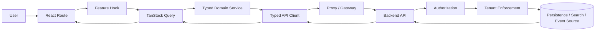
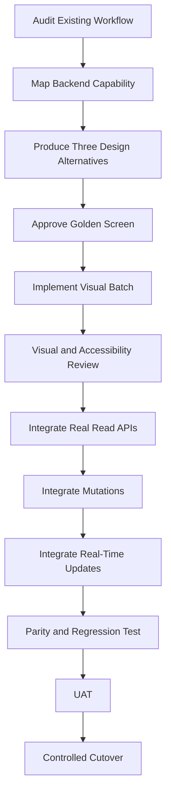
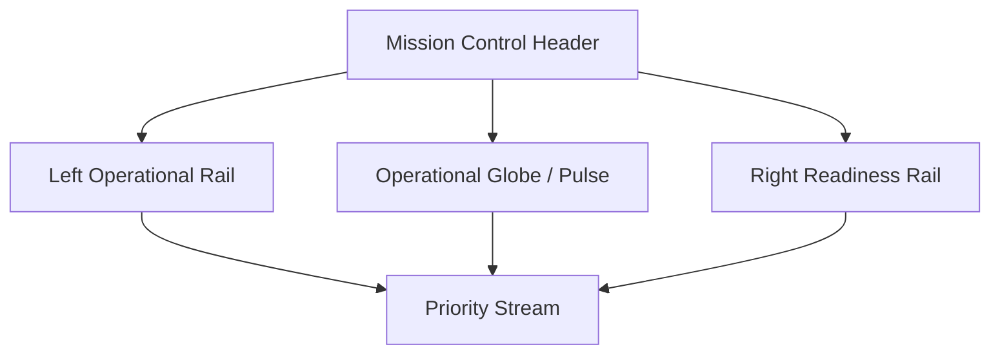

# HiveArmor Frontend V3 Requirements Specification

**Document type:** Product, UX, UI, frontend architecture, quality, and delivery specification  
**Product:** HiveArmor  
**Product expansion:** Hybrid Intelligence & Visibility Engine for Advanced Response, Monitoring, Orchestration and Resilience  
**Repository directory:** `frontend-v3/`  
**Product model:** One unified HiveArmor platform; `frontend-v3` is a technical directory name, not a separate product edition  
**Status:** Baseline requirements for design, implementation, testing, and acceptance  
**Intended readers:** Product owners, UX designers, frontend engineers, backend engineers, security architects, QA engineers, accessibility reviewers, and Claude Code agents

---

## 1. Purpose

This document consolidates the approved requirements for the clean HiveArmor frontend implementation. It is the authoritative baseline for:

- The application shell and visual identity
- Information architecture and navigation
- Page layouts and workflow patterns
- Frontend technology boundaries
- Backend-to-UI capability mapping
- Multi-tenant and MSSP behaviour
- Security and permission handling
- Data grids, charts, dashboards, search, graphs, and builders
- Mission Control
- Analyst workflows
- Investigation, detection, response, posture, reporting, and administration
- Parser Intelligence
- Accessibility, responsiveness, performance, testing, and visual quality
- Incremental, non-destructive implementation
- Route parity and production cutover

The objective is to create a unique, modern, professional enterprise SIEM experience without breaking or silently removing existing functionality.

---

## 2. Product Vision

HiveArmor must present a coherent operational environment for security monitoring, investigation, detection, response, posture management, reporting, and administration.

The frontend must feel:

- Advanced but not theatrical
- Dense but not cluttered
- Defence-inspired but not weapon-oriented
- Technically credible
- Appropriate for enterprise SOC analysts, managers, administrators, auditors, and MSSP operators
- Distinct from generic AI-generated admin dashboards
- Consistent across all modules

The design direction is named:

> **HiveArmor Command Theme**

The experience should combine:

- Queue continuity inspired by mature SIEM analyst workflows
- Investigation narrative and entity context
- Search and event-exploration density
- Persistent incident and investigation context
- Restrained enterprise dark surfaces
- A unique HiveArmor visual language
- Evidence-based AI assistance
- Controlled mission-control visualisation where operationally useful

HiveArmor must not become a visual clone of Splunk, Elastic, Exabeam, LogRhythm, Wazuh, Grafana, OpenShift, or any other product.

---

## 3. Core Principles

### 3.1 One unified product

All approved capabilities belong to one unified HiveArmor platform. Engineering may deliver the platform in small batches, but product scope must not be divided into artificial editions or future-version placeholders.

### 3.2 Clean frontend implementation

`frontend-v3/` is a clean implementation. It must not inherit visual debt from existing frontends.

### 3.3 Preserve functionality

Existing backend functionality must be represented in the new UI or explicitly classified as internal-only, deprecated, or pending a product decision.

### 3.4 Design before implementation

Golden screens, component patterns, states, data contracts, and interaction behaviour must be approved before large-scale route implementation.

### 3.5 Small, tested batches

Implementation must proceed through small, reviewable batches. Each batch must have:

- Explicit scope
- Approved files
- Defined tests
- Risks
- Rollback
- Validation results
- A stop point before the next batch

### 3.6 Real data only in production

Production routes must never display mock, random, sample, or fallback records in place of real backend data.

### 3.7 Progressive disclosure

Operationally important information must be immediately visible. Supporting details should appear through drawers, tabs, drill-downs, expandable sections, or focus modes.

### 3.8 Backend security remains authoritative

Frontend permissions improve presentation and usability but are never the sole security boundary.

### 3.9 AI proposes; deterministic systems execute

AI may summarise, classify, correlate, recommend, or generate controlled configuration. It must not silently perform high-impact actions or execute unrestricted generated code.

---

## 4. Goals

The frontend must:

1. Provide UI coverage for all approved user-facing backend capabilities.
2. Replace fragmented page-specific designs with one coherent application frame.
3. Support high-density SOC workflows efficiently.
4. Preserve navigation, filters, selection, scroll position, and investigation context.
5. Support a unified multi-tenant MSSP experience with backend-enforced isolation.
6. Provide strong analyst queue, incident investigation, search, detection, and response workflows.
7. Provide high-quality dashboards and dashboard authoring.
8. Support evidence, investigation sessions, entity relationships, and threat graphs.
9. Support Parser Intelligence for unparsed events, parser drift, AI-assisted parser creation, validation, deployment, and rollback.
10. Meet enterprise expectations for accessibility, auditability, reliability, and maintainability.
11. Provide a distinctive Mission Control page without turning the entire product into a futuristic HUD.
12. Maintain route and capability parity until production cutover is complete.

---

## 5. Non-Goals

The frontend must not:

- Rebuild backend business logic in the browser
- Connect directly to PostgreSQL, OpenSearch, Neo4j, Redpanda, object storage, or internal service ports
- Rely on frontend-only tenant isolation
- Use multiple overlapping UI systems
- Use demo data as a production fallback
- Use AI-generated arbitrary executable code
- Use a weapon-targeting visual language
- Turn every page into a dashboard
- Add motion or decorative visualisations without operational meaning
- Remove existing functionality silently
- Delete or disable the existing frontend before parity and cutover approval
- Perform frontend and backend refactoring in the same unapproved batch

---

## 6. Frontend Architecture

### 6.1 Approved technology stack

| Concern | Approved approach |
|---|---|
| Application framework | React with exact approved stable version |
| Build system | Vite with exact approved stable version |
| Language | TypeScript in strict mode |
| Routing | React Router, exact approved stable version pinned |
| Core UI components | PatternFly 6 |
| Styling | PatternFly tokens, HiveArmor semantic tokens, CSS Modules |
| Dense operational grids | AG Grid Community through `SiemDataGrid` |
| Standard small tables | PatternFly Table |
| Charts | Apache ECharts through `HaChart` |
| Dashboard layout | GridStack.js through `DashboardCanvas` |
| Server state | TanStack Query v5 |
| Temporary interaction state | Zustand v5 |
| Query and rule editors | Monaco Editor |
| Graph and workflow canvases | React Flow |
| Runtime contract validation | Approved schema-validation library where required |
| Component catalogue | Storybook |
| Unit and component testing | Vitest |
| End-to-end and visual testing | Playwright |
| Accessibility testing | axe plus manual keyboard review |

Exact versions must be verified, reviewed, and pinned. Unbounded `latest` dependencies are prohibited.

### 6.2 Forbidden overlapping technologies

Do not introduce:

- Tailwind CSS
- Radix UI
- Ant Design
- Material UI
- Bootstrap
- shadcn/ui
- SWR
- RTK Query
- Redux
- MobX
- Chart.js
- Recharts
- D3 directly for ordinary product charts
- CodeMirror
- Ace

A supporting dependency may be proposed when it does not overlap with an approved architectural responsibility.

### 6.3 Dependency approval

Before adding a dependency, document:

1. Purpose
2. Existing alternative
3. Bundle impact
4. Maintenance impact
5. Licence
6. Security considerations
7. Exact version
8. Removal or replacement risk

### 6.4 Recommended source layout

```text
frontend-v3/
├── src/
│   ├── app/
│   │   ├── routes/
│   │   ├── providers/
│   │   ├── shell/
│   │   └── router/
│   ├── design-system/
│   │   ├── tokens/
│   │   ├── components/
│   │   ├── patterns/
│   │   ├── brand/
│   │   └── index.ts
│   ├── features/
│   │   ├── mission-control/
│   │   ├── analyst-queue/
│   │   ├── alerts/
│   │   ├── correlated-findings/
│   │   ├── incidents/
│   │   ├── investigations/
│   │   ├── search-hunt/
│   │   ├── entities/
│   │   ├── hive-intelligence/
│   │   ├── detections/
│   │   ├── response/
│   │   ├── posture/
│   │   ├── dashboards/
│   │   ├── reports/
│   │   ├── parser-intelligence/
│   │   └── administration/
│   ├── infrastructure/
│   │   ├── api-client/
│   │   ├── auth/
│   │   ├── permissions/
│   │   ├── tenant/
│   │   ├── query/
│   │   ├── realtime/
│   │   ├── telemetry/
│   │   └── storage/
│   ├── shared/
│   │   ├── contracts/
│   │   ├── formatters/
│   │   ├── validators/
│   │   ├── hooks/
│   │   └── utilities/
│   └── test/
├── stories/
├── e2e/
├── public/
└── docs/
```

Feature folders may be adjusted to the actual repository conventions, but responsibilities must remain separated.

---

## 7. Repository Isolation and Migration Safety

### 7.1 Isolation

- `frontend-v3/` must not import source files from existing frontend implementations.
- Existing frontends must not be modified during a V3 feature batch.
- Backend source must not be changed during a frontend-only batch.
- Shared changes require a separately approved task.
- Database, OpenSearch, Neo4j, Redpanda, infrastructure, and deployment changes require separate approval.
- No automatic commit, push, merge, deploy, or production-route change is permitted.

### 7.2 Reusable material

Reusable after verification:

- API contracts
- DTO semantics
- Authentication behaviour
- Permission semantics
- Query parameters
- Pagination contracts
- SSE/WebSocket protocols
- Business rules
- Formatters
- Validators
- Non-UI assets
- Test scenarios

Do not directly reuse:

- Page components
- Layout components
- Existing global CSS
- Tailwind utilities
- Radix primitives
- Existing cards
- Existing tables
- Existing drawers
- Page-specific colours
- Demo-data modules
- Random KPI or chart data

### 7.3 Parity tracking

Maintain:

- `docs/frontend-v3/backend-capability-matrix.md`
- `docs/frontend-v3/route-parity-register.md`
- `docs/frontend-v3/decision-register.md`
- `docs/frontend-v3/risk-register.md`

A route cannot be considered complete until the parity register is updated.

---

## 8. Product Terminology

Use:

- HiveArmor
- Mission Control
- Command Center
- Analyst Queue
- Defensive Posture
- Sensor Grid
- Readiness Matrix
- Threat Constellation
- Hive Intelligence
- Response Authority
- Security SITREP
- After-Action Review
- Strategic Overview
- Operational Overview
- Tactical Overview
- Investigation Session
- Correlated Finding
- Incident

Do not use in ordinary production UI:

- Hive Armor
- Hive-Armor
- HIVEARMOR, except approved artwork
- Hexagram
- Target lock
- Weapon
- Enemy
- Strike
- Kill
- Battlefield
- Neutralise/neutralize as a generic action
- Game-like ranks or scoring language

Use “hexagonal” or “honeycomb”, never “hexagram”.

### 8.1 Alert, correlated finding, and incident model

```text
Alert
  → one security event or detection

Correlated Finding / Offense
  → machine-correlated group or higher-level finding

Incident
  → analyst-managed security case

After-Action Review
  → post-closure analysis and learning
```

“Case” may be used as a user-friendly alias for Incident but must not become a third competing entity.

---

## 9. Design Constitution

### 9.1 Canonical palette

```css
--ha-background: #070A0F;
--ha-surface-primary: #0D131C;
--ha-surface-raised: #131C28;
--ha-border: #253244;

--ha-primary: #32D6C5;
--ha-intelligence: #8B7CFF;

--ha-critical: #FF5D6C;
--ha-high: #FFAA45;
--ha-medium: #5AA7FF;
--ha-positive: #40D69A;

--ha-text-primary: #E8EDF4;
--ha-text-secondary: #97A6B8;
```

Canonical values are immutable.

Derived semantic tokens are permitted when they:

- Reference a canonical token
- Use a documented opacity or tonal derivation
- Have a clear semantic name
- Are centrally defined
- Meet contrast requirements

Examples:

```css
--ha-surface-hover;
--ha-surface-selected;
--ha-border-subtle;
--ha-focus-ring;
--ha-text-disabled;
--ha-action-primary-hover;
--ha-overlay-background;
--ha-critical-subtle-background;
--ha-intelligence-subtle-background;
```

### 9.2 Colour meaning

| Colour | Meaning |
|---|---|
| Teal | Primary action, selection, live state, current operational activity |
| Violet | AI, intelligence provenance, inference, forecast, automated correlation |
| Red | Critical severity, destructive failure, immediate operational risk |
| Amber | High severity, warning, degradation, SLA risk |
| Blue | Medium severity or supporting analytical information |
| Green | Healthy, connected, successful, contained, verified, resolved |
| Neutral | Low/informational severity, categories, metadata, inactive states |

AI provenance must never override severity. A critical AI-generated finding remains red and receives a separate violet intelligence badge.

### 9.3 Typography

Use:

- Inter or Geist for interface text
- JetBrains Mono or approved equivalent for logs, queries, hashes, IDs, and technical values
- Tabular numerals for metrics, timestamps, counts, and scores

Avoid unreadable micro-text and excessive all-uppercase copy.

### 9.4 Geometry and elevation

- Standard radius: 4–6 px
- Maximum widget radius: 8 px
- One-pixel structural borders
- Minimal shadow
- No glassmorphism
- No heavy blur
- No large neon glow
- No oversized rounded cards
- No decorative gradients
- No nested card stacks without a strong structural reason

### 9.5 Honeycomb usage

Allowed:

- Login
- Empty states
- Low-density page-header decoration
- Dashboard Studio edit canvas
- Threat Constellation
- Sensor Grid coverage
- Simulation Arena
- Limited Mission Control decoration

Not allowed behind:

- Data grids
- Forms
- Logs
- Evidence
- Query editors
- Timelines
- Notes
- Dense charts

### 9.6 Density modes

- **Comfortable:** Administration, forms, onboarding, executive views
- **Compact:** Default SOC pages
- **Dense:** Raw events, hunt results, high-volume operational grids

Pages must not invent additional density systems.

---

## 10. HiveArmor Command Frame

Every authenticated page must use the same application frame.

```text
┌────────────────────────────────────────────────────────────────────┐
│ Global Masthead                                                    │
├───────────────┬───────────────────────────────────────┬────────────┤
│ Primary       │ Page Context Header                   │ Optional   │
│ Navigation    ├───────────────────────────────────────┤ Context    │
│               │ Sticky Page Toolbar                   │ Drawer     │
│               ├───────────────────────────────────────┤            │
│               │ Main Workspace                        │            │
├───────────────┴───────────────────────────────────────┴────────────┤
│ Optional Operations Status Dock                                   │
└────────────────────────────────────────────────────────────────────┘
```

### 10.1 Dimensions

- Masthead: 56 px
- Expanded navigation: 240 px
- Collapsed navigation: 64 px
- Sticky toolbar: 44–48 px
- Desktop context drawer: approximately 420 px
- Optional status dock: 28 px

### 10.2 Masthead

The masthead may include:

- HiveArmor logo and wordmark
- Global search and command palette
- Environment context
- Tenant context
- Data-health indicator
- Real-time connection state
- Background-job indicator
- Hive Intelligence entry
- Notifications
- Help
- User profile

Do not duplicate primary navigation in the masthead.

### 10.3 Global search and command palette

Search targets may include:

- Alert ID
- Incident ID
- Correlated finding
- Investigation session
- User
- Identity
- Host
- IP address
- Domain
- Hash
- Cloud resource
- Detection rule
- Dashboard
- Report
- Tenant

Commands may include:

- Open route
- Open recent item
- Create Incident
- Create Investigation Session
- Run saved query
- Switch tenant
- Open assigned work
- Execute a permitted quick action

### 10.4 Primary navigation behaviour

- Expanded width: 240 px
- Collapsed width: 64 px
- Item height: approximately 40 px
- Active item: 3 px teal indicator, subtle raised surface, teal icon and primary text
- No full teal background
- No glow
- Counters only for actionable work

### 10.5 Page header

Each page header contains:

- Breadcrumb where needed
- Page title
- Optional subtitle
- Current state
- Relevant tenant/environment/time context
- One clear primary action
- Limited secondary actions

### 10.6 Page toolbar

The page toolbar contains:

- Saved view
- Search
- Filters
- Time range
- Refresh/live state
- Density
- Column controls where applicable
- Export where permitted

Maximum two toolbar rows.

### 10.7 Context drawer

At 1280 px and above:

- Inline primary-detail drawer
- No scrim
- Main workspace remains interactive
- Selection and scroll position remain visible

At 1024 px:

- Overlay drawer or controlled bottom sheet
- Scrim
- Background inert
- Focus trapped
- Escape closes
- Focus returns to the originating control

Only one contextual drawer may be open at a time.

### 10.8 Operations status dock

Optional compact status area for:

- Real-time connection
- Ingestion freshness
- Background jobs
- Degraded data sources
- Current tenant and environment
- Build/version information where appropriate

Hide it on login and document-oriented report pages.

---

## 11. Information Architecture

Use one consistent navigation model.

### COMMAND

- Mission Control
- Command Center
- Analyst Queue
- Incidents
- Alerts
- Correlated Findings, only if the product model requires a separate route

### INVESTIGATE

- Search & Hunt
- Investigation Sessions
- Entities
- Threat Constellation
- Hive Intelligence

### DEFEND

- Detection Rules
- Correlation Rules, when distinct
- Response Playbooks
- Response Authority
- Response Activity

### POSTURE

- Assets
- Identities
- Vulnerabilities
- Exposure
- Sensor Grid
- Readiness Matrix
- Compliance

### DASHBOARDS

- Strategic Overview
- Operational Overview
- Tactical Overview
- Saved Dashboards
- My Dashboards
- Dashboard Studio

### REPORT

- Security SITREP
- Incident Reports
- After-Action Reviews
- Scheduled Reports
- Report Templates

### ADMINISTRATION

- Tenants
- Users & Roles
- Integrations
- Notifications
- Retention
- Data Parsing
- Parser Intelligence
- Connection Keys
- Audit Logs
- Platform Settings

Rules:

- Runtime navigation must hide unfinished or unauthorized routes.
- Product specifications must still include all approved modules.
- Administration stays at the bottom.
- Backend technology names must not be primary menu labels.
- Route names must remain consistent across all screens and documentation.

---

## 12. Page Archetypes

Every route must use an approved page archetype.

### 12.1 Operational Queue

Used for:

- Analyst Queue
- Alerts
- Incidents
- Correlated Findings
- Assets
- Identities
- Vulnerabilities
- Sensor Grid records

Structure:

```text
Page Header
Sticky Toolbar
Operational Grid
Context Drawer
Optional compact summary strip
```

### 12.2 Investigation Workbench

Used for:

- Incident Investigation
- Investigation Session
- Evidence Workspace
- After-Action Review

Structure:

```text
Case Context
Main Investigation Workspace
Action / Evidence Rail
Tabbed or sectioned deep content
```

### 12.3 Search Explorer

Used for:

- Search & Hunt
- Raw Event Explorer
- Rule Test Results

Structure:

```text
Field Explorer
Query Editor
Histogram
Results Grid
Event Detail Drawer
```

### 12.4 Entity Intelligence

Used for:

- Entity Profile
- Threat Constellation
- Attack-path analysis

### 12.5 Dashboard

Used for:

- Mission Control
- Command Center
- Strategic Overview
- Operational Overview
- Tactical Overview
- Readiness Matrix

### 12.6 Builder

Used for:

- Dashboard Studio
- Metric Builder
- Detection Rule Editor
- Correlation Rule Editor
- Playbook Builder
- Report Template Builder

### 12.7 Governance

Used for:

- Response Authority
- Response Activity
- Audit Logs
- Compliance
- Retention
- After-Action Review

### 12.8 Administration

Used for:

- Tenants
- Users & Roles
- Integrations
- Notifications
- Connection Keys
- Data Parsing
- Parser Intelligence
- Platform Settings

---

## 13. Shared Domain Components

Application pages should use HiveArmor abstractions rather than assembling third-party primitives repeatedly.

Required shared components include:

- `HaAppShell`
- `HaMasthead`
- `HaNavigation`
- `HaPageHeader`
- `HaPageToolbar`
- `HaFilterBar`
- `HaContextDrawer`
- `SiemDataGrid`
- `HaChart`
- `DashboardCanvas`
- `SeverityLabel`
- `StatusLabel`
- `RiskScore`
- `ConfidenceIndicator`
- `EntityBadge`
- `SlaIndicator`
- `DataHealthIndicator`
- `HiveIntelligenceBadge`
- `LoadingState`
- `EmptyState`
- `ErrorState`
- `AccessDeniedState`
- `StaleDataState`
- `SessionExpiredState`

Library boundaries:

- AG Grid only through `SiemDataGrid`
- ECharts only through `HaChart`
- GridStack only through `DashboardCanvas`
- Authentication through an authentication adapter
- Permissions through a permission service or hook
- API access through a typed API client
- No API calls inside presentational components

---

## 14. Data Grid Requirements

### 14.1 AG Grid Community

Use AG Grid Community for high-density, large operational datasets.

Approved surfaces:

- Analyst Queue
- Alerts list
- Incidents list
- Correlated Findings
- Search & Hunt results
- Raw events
- Assets
- Identities
- Sensor/service health records
- Detection-rule execution results

Use PatternFly Table for:

- Small administration lists
- Configuration tables
- Wizard reviews
- Connection keys
- Report schedules
- Small audit lists when scale does not justify AG Grid

### 14.2 `SiemDataGrid`

`SiemDataGrid` must provide:

- Infinite Row Model
- Backend pagination
- Backend sorting
- Backend filtering
- Column resizing
- Column reordering
- Column pinning
- Custom column-visibility menu
- Multi-row selection
- Bulk-action toolbar slot
- Custom cell renderers
- Keyboard navigation
- Stable row IDs
- CSV export where permitted
- Density control
- Loading, empty, error, stale, and denied states
- Context actions through an approved popover
- Tenant-aware and user-aware grid-state persistence

### 14.3 Community-only constraints

Do not depend on:

- Server-Side Row Model
- Enterprise row grouping
- Enterprise pivoting
- Integrated charts
- Excel export
- Enterprise context menus
- Enterprise aggregation panels

### 14.4 Infinite Row Model adapter

```text
AG Grid request
  startRow
  endRow
  sortModel
  filterModel
        ↓
Validated frontend adapter
        ↓
Typed backend request
  page/offset
  size/limit
  allow-listed sort
  allow-listed filter
        ↓
Backend response
  rows
  totalCount/lastRow
```

Never send raw `filterModel` directly to SQL or OpenSearch.

### 14.5 Grid-state persistence

Persist:

- Visibility
- Order
- Width
- Pinning
- Sorting
- Density

Version the state:

```json
{
  "schemaVersion": 1,
  "gridId": "alerts-list",
  "tenantId": "tenant-id",
  "columnState": [],
  "density": "compact"
}
```

---

## 15. Charts and Visual Analytics

All charts must use `HaChart`.

Every chart must support:

- Consistent HiveArmor ECharts theme
- Loading
- No-data
- Error
- Resize
- Tooltip
- Number and timestamp formatting
- Accessible description
- Drill-down where meaningful
- Export permission where permitted
- Text or table alternative for critical information

Rules:

- Severity colours only for severity
- Health colours only for health
- Violet only for AI/intelligence provenance
- Category charts use neutral categorical styling
- Severity percentages must total 100%
- Use counts when percentage is misleading
- MITRE intensity charts require a defined scale and legend
- No random KPI sparklines
- No decorative chart without operational meaning
- No ordinary bar-chart gradients
- Important fixture values must be labelled illustrative in Storybook and visual specifications

---

## 16. Multi-Tenancy and MSSP Requirements

Multi-tenancy is a full-stack security boundary.

### 16.1 Tenant UX

The frontend must support:

- Current tenant visible in the masthead
- Searchable tenant selector for multi-tenant users
- No unnecessary selector for users with one tenant
- Clearly differentiated all-tenant mode
- Recently used tenants
- Favourite tenants where useful
- Tenant context preserved during navigation
- Tenant badges in cross-tenant views
- Tenant-aware saved views
- Tenant-aware dashboards
- Tenant-aware reports
- Tenant-aware investigations
- Tenant-aware incidents
- Tenant-aware exports
- Tenant-specific settings
- Tenant-specific integrations
- Tenant-specific retention
- Tenant-aware audit history

### 16.2 All-tenant mode

All-tenant mode:

- Requires explicit permission
- Must be visually obvious
- Must never resemble an ordinary tenant
- Must display the applied scope in search, reports, exports, and actions
- Must require elevated confirmation for disruptive cross-tenant operations
- Must show affected tenants before action execution

### 16.3 Tenant switching

Tenant switching must:

- Partition or invalidate query caches safely
- Prevent stale records from the previous tenant
- Prompt when unsaved work exists
- Close or reload incompatible drawers
- Partition local grid and view state by user and tenant
- Preserve only safe global preferences

### 16.4 Backend enforcement

The UI specification assumes backend enforcement for:

- Authenticated tenant identity
- Tenant authorization
- PostgreSQL scoping
- OpenSearch filter injection
- Neo4j scoping
- Object-storage scoping
- Dashboard ownership
- Saved-view ownership
- Investigation ownership
- Report ownership
- Export scoping
- Notification scoping
- Audit scoping
- Cache partitioning
- SSE/WebSocket isolation

Any tenant control enforced only in frontend code is a critical security gap.

---

## 17. Authentication, Authorization, and Session UX

### 17.1 Authentication flow

Use a step-based authentication container:

```text
Credentials
  → MFA challenge
  → Session initialisation
```

Do not open MFA in a right-side drawer.

Support:

- Password authentication
- SSO when verified
- MFA
- Backup code
- Invalid credentials
- Locked account
- Deactivated account
- Session expired
- Network failure
- Maintenance notice

Login must work at:

- 1920 px
- 1440 px
- 1280 px
- 1024 px
- 768 px
- 360 px

Do not show unverified security or SLA claims.

### 17.2 Authentication architecture

- Authentication adapter owns session/token behaviour.
- Typed API client attaches approved credentials.
- Vite development proxy forwards headers unchanged.
- Development proxy must not generate or inject tokens.
- No hard-coded tokens.
- No backend secrets in `VITE_*` variables.
- No tokens or session identifiers in logs.
- Production proxying uses the approved gateway or reverse proxy.

### 17.3 Permission-based UX

Use user-facing permissions, not internal role constants.

Do not show:

- `ROLE_ADMIN`
- `ROLE_ANALYST`
- `ROLE_VIEWER`
- `ROLE_SUPER_ADMIN`

Use:

```text
Access restricted

Required permission:
Search & Hunt — View Security Events

Current access:
Security Overview — Read Only
```

Role templates may include:

- Platform Administrator
- Tenant Administrator
- SOC Manager
- Analyst
- Threat Hunter
- Detection Engineer
- Response Approver
- Auditor

Assignments may include:

- Shift Lead
- Incident Lead
- Investigation Owner
- On-call Analyst

Assignments must not automatically become permanent application roles.

Frontend checks control presentation only. Backend authorization remains authoritative.

---

## 18. Mission Control Requirements

Mission Control is HiveArmor’s signature operational page.

### 18.1 Design concept

> **HiveArmor Mission Control — Operational Pulse**

Mission Control may use a more expressive HUD-inspired visual layer, but it must remain within the standard HiveArmor Command Frame.

It must not resemble:

- Weapon control
- Targeting
- Gaming
- Neon hacker styling
- Cryptocurrency dashboards
- Stock HUD templates

### 18.2 Normal page composition

At 1440 px and above:

```text
┌───────────────────────────────────────────────────────────────────┐
│ Mission Control Header                                            │
├─────────────────┬───────────────────────────────┬─────────────────┤
│ Left Rail       │ Operational Globe / Pulse     │ Right Rail      │
│                 │                               │                 │
│ Defensive       │ Global security posture       │ Threat          │
│ Posture         │ Threat arcs and markers       │ Conditions      │
│ Priority Work   │ Sensor coverage               │ Response        │
│ Sensor Coverage │ MITRE / attack-stage activity │ Readiness       │
│ Analyst Capacity│ Selected incident context     │ Data Health     │
├─────────────────┴───────────────────────────────┴─────────────────┤
│ Priority Stream                                                   │
└───────────────────────────────────────────────────────────────────┘
```

### 18.3 Central visualisation

Preferred concept:

- A restrained 3D or pseudo-3D operational globe combined with concentric operational pulse layers
- Threat arcs between source and affected regions where real geo-data exists
- Markers for a maximum of five critical incidents/findings
- Sensor-coverage segments
- Current defensive-posture score
- Selected tenant and time scope
- Data freshness indication

The globe is not a decorative world map.

It must answer:

1. What is the current defensive posture?
2. Where are important threats or affected regions?
3. Which incidents/findings drive the current state?
4. Is telemetry complete and fresh?
5. Which attack stages are active?

### 18.4 Globe implementation

Use the existing `HaChart`/ECharts capability where feasible.

If a true 3D globe requires an additional library or ECharts extension, it must pass dependency approval. Until then, a 2D orthographic projection or custom SVG/canvas visual is acceptable.

The visual must have:

- Accessible text summary
- Table/list equivalent
- Keyboard-selectable markers
- Tooltips
- Defined data meaning
- Empty state
- Loading state
- Error state
- Reduced-motion behaviour

### 18.5 Animation

Allowed:

- Slow globe rotation when no marker is selected
- One subtle operational sweep
- Very slow ring movement
- One live-state pulse
- Short data-update transition

Prohibited:

- Fast radar rotation
- Target lock
- Flashing markers
- Crosshair animation
- Particle effects
- Moving background grid
- Random waveforms
- Continuous glow
- Audio

Animation must:

- Be pausable
- Pause when the tab is hidden
- Clean up on unmount
- Respect `prefers-reduced-motion`
- Not be the only representation of data

### 18.6 Supporting panels

Left:

- Defensive Posture
- Priority Work
- Sensor Coverage
- Analyst Capacity

Right:

- Threat Conditions
- Response Readiness
- Detection Health
- Data Health

Bottom Priority Stream:

- Critical Incident
- High-risk Alert
- Correlated Finding
- Failed Response Action
- SLA Breach Risk
- Degraded Sensor
- Data Freshness Failure

Selecting an item opens the standard context drawer.

### 18.7 Mission Control focus mode

Focus mode may:

- Collapse navigation
- Maximise the central visual
- Preserve header controls
- Keep tenant, environment, and time context visible
- Retain an accessible exit control

Focus mode must not create a separate shell.

---

## 19. Command Center Requirements

Command Center answers:

> What requires attention now?

Recommended content:

- Critical incidents
- Unassigned work
- SLA breach risk
- Alert-volume change
- Ingestion health
- Response failures
- Threat-activity trend
- Workload and analyst capacity
- Sensor Grid health
- Detection health
- Response activity
- Shift-handover items

Do not turn Command Center into a chart gallery.

Every widget must answer:

- What changed?
- Why does it matter?
- What should the user open next?

---

## 20. Analyst Queue Requirements

Analyst Queue is the primary work-management surface.

### 20.1 Work-item types

- Individual alert
- Correlated finding
- Incident
- Investigation task
- Approval request
- Failed response action
- SLA breach risk
- Data-quality issue
- Sensor issue affecting investigations

### 20.2 Columns

- Severity
- Work-item type
- Title
- Tenant
- Confidence
- Risk
- Status
- Assigned analyst
- Affected entities
- Detection source
- Alert count
- Created
- Last activity
- SLA

### 20.3 Interactions

- Backend filtering
- Backend sorting
- Infinite loading/pagination
- Saved views
- Column customisation
- Density
- Multi-selection
- Bulk assignment
- Bulk status
- Create Incident
- Attach to Incident
- Open Investigation
- Context drawer
- Full workbench
- Preserved scroll
- Preserved filters
- Keyboard navigation
- Real-time row updates

Recommended keyboard shortcuts:

- `J` / `K`: next/previous work item
- `Enter`: open
- `A`: assign to me
- `I`: open/create Incident
- `Esc`: close context drawer

No row drag for authoritative backend records.

---

## 21. Alerts Requirements

Alerts page supports:

- List view
- Severity Board
- Alert context drawer

Both views must share:

- Search
- Filters
- Time range
- Tenant scope
- Saved view
- Status actions
- Counts
- Real backend source

List view uses `SiemDataGrid`.

Severity Board:

- Shows critical/high/medium/low or informational groupings
- Must not allow drag-and-drop unless moving a card performs an explicit, permission-controlled, audited backend severity change
- Must preserve filters when switching views

Actions may include:

- Acknowledge
- Assign
- Mark under review
- Close where permitted
- Add to Incident
- Open Investigation
- Run Playbook
- Suppress or tune detection where permitted
- Open in Search & Hunt

Use explicit action wording.

---

## 22. Correlated Findings Requirements

Correlated Findings may be:

- A dedicated route
- A saved Analyst Queue view
- A tab under Alerts

The final choice depends on product and backend evidence.

Requirements:

- Finding list
- Finding detail
- Related alerts
- Related entities
- Correlation explanation
- Confidence
- Evidence
- Attach to Incident
- Promote to Incident
- Suppress or tune where permitted
- Audit history

The UI must clearly distinguish machine correlation from analyst-managed Incident workflow.

---

## 23. Incidents Requirements

### 23.1 Incident list

Columns:

- Severity
- Incident ID
- Tenant
- Title
- Status
- Assignee
- Related findings
- Affected entities
- Created
- Last activity
- SLA
- Disposition

Context drawer:

- Summary
- Latest activity
- Affected entities
- Related alerts/findings
- Pending actions
- SLA
- Open Investigation

### 23.2 Incident creation and update

Support:

- Create
- Edit
- Assign
- Change status
- Change severity
- Add alerts/findings
- Add evidence
- Add notes
- Add tasks
- Close/reopen
- Audit

Incident closure requires:

- Disposition
- Closure reason
- Required validation
- Confirmation
- Audit event

---

## 24. Incident Investigation Requirements

Incident Investigation is a workbench, not a standard detail page.

Primary areas:

- Overview
- Evidence
- Attack Story
- Timeline
- Entities
- Response
- Collaboration
- Activity & Audit

Grouping:

### Evidence

- Related alerts
- Evidence items
- Queries
- Attachments
- Integrity information

### Collaboration

- Notes
- Tasks
- Hypotheses
- Shift handover

### Activity & Audit

- Activity
- Changes
- Automation history
- Audit events

The Overview must answer:

1. What happened?
2. Why does it matter?
3. What is affected?
4. What evidence supports it?
5. What evidence contradicts it?
6. What evidence is missing?
7. What action is recommended?
8. What happened most recently?

Requirements:

- URL-deep-linked tabs
- Lazy loading
- Preserved context
- Evidence relationships
- Append-only authoritative activity
- Response governance
- Audit records
- After-Action Review creation

---

## 25. Evidence Workspace Requirements

Use a hybrid persistence model:

- `EvidenceItem`
- `EvidenceBoard`
- `EvidencePlacement`
- `EvidenceRelationship`

Evidence identity and metadata must be separate from visual placement.

Support:

- Board view
- Canonical Evidence List
- Persisted position
- Grouping
- Relationships
- Integrity state
- Evidence type
- Source
- Timestamp
- Confidence
- Analyst note
- Attachments
- Chain-of-custody information where required
- Versioning
- Optimistic concurrency
- Permission control
- Audit history

The visual board must never be the only way to access evidence.

---

## 26. Investigation Sessions Requirements

Investigation Sessions act as an analyst notebook.

Structure:

```text
Left: Session Outline
  Queries
  Pinned events
  Alerts
  Entities
  Hypotheses
  Tasks

Centre:
  Active query
  Evidence list
  Timeline
  Notes

Right:
  Evidence/context drawer
```

Actions:

- Share
- Hand over
- Convert to Incident
- Export permitted summary
- Close session

Requirements:

- Persisted sessions
- Tenant-aware ownership
- Collaboration
- Audit history
- Pinned evidence
- Saved queries
- Hypotheses
- Tasks
- Session state and handover

---

## 27. Search & Hunt Requirements

Layout:

```text
Field Explorer
Query Editor
Event Histogram
Results Grid
Event Detail Drawer
```

Capabilities:

- Dataset selector
- Tenant scope
- Time selector
- Field explorer
- Monaco query editor
- Query validation
- Query history
- Saved queries
- Event histogram
- AG Grid results
- Event context drawer
- Entity pivots
- Add to Investigation Session
- Add as Evidence
- Create Detection Rule
- Export permitted results

The browser must not submit unrestricted OpenSearch DSL.

Backend enforcement:

- Dataset allow-list
- Tenant filter
- Field allow-list
- Operator allow-list
- Time-range limits
- Result limits
- Bucket limits
- Timeouts
- Sensitive-field masking
- Query audit

Suggested dimensions:

- Field explorer: 240–280 px
- Query editor: 120–180 px adjustable
- Histogram: 120–160 px
- Detail drawer: 420 px
- Results grid fills remaining height

---

## 28. Entities and Threat Constellation

### 28.1 Entity Profile

Default to a searchable entity list and profile.

Tabs:

- Overview
- Activity
- Alerts
- Incidents
- Relationships
- Risk
- Evidence

Entity types may include:

- User
- Identity
- Host
- IP address
- Domain
- Process
- File
- Hash
- Cloud resource
- Application
- Business service

### 28.2 Threat Constellation

Threat Constellation opens for a selected entity, incident, or investigation scope.

Support:

- Expand one hop
- Relationship filtering
- Time filtering
- Confidence filtering
- Shortest path
- Lateral movement
- Process ancestry
- Shared infrastructure
- Cloud privilege paths
- Crown-jewel exposure
- Evidence-linked relationships
- Related incidents
- Pin to Investigation
- Save graph view

Colour:

- Teal: selected verified paths
- Violet: inferred/intelligence relationships

Do not create an uncontrolled graph “hairball”.

The browser must not connect directly to Neo4j.

---

## 29. Hive Intelligence Requirements

Hive Intelligence exists as:

1. A global assistant/contextual capability
2. A dedicated page

Every AI-supported result must show:

- AI-generated label
- Generated time
- Confidence
- Confidence definition
- Supporting evidence
- Contradictory evidence
- Missing evidence
- Observed facts
- Inferences
- Recommended action
- Provider/model where permitted
- Analyst feedback
- Audit event

AI recommendations must not be presented as authoritative response actions.

Violet indicates AI/intelligence provenance only.

---

## 30. Detection Rules Requirements

### 30.1 Rule list

Columns:

- Status
- Rule
- Type
- Severity
- Data source
- MITRE mapping
- Last triggered
- Trigger count
- False-positive indicator
- Owner
- Version

### 30.2 Rule editor

Layout:

```text
Left: Metadata and configuration
Centre: Monaco editor
Right: Validation, MITRE mapping, test controls
Bottom: Test results and sample matches
```

Support:

- Create/edit
- Validate
- Test
- Enable/disable
- Version
- Change history
- Execution history
- Permissions
- Audit

---

## 31. Correlation Rules Requirements

When correlation rules are distinct from detection rules, support:

- Rule list
- Event/grouping criteria
- Window
- Threshold
- Entity aggregation
- Suppression
- Correlation explanation
- Simulation/test
- Output finding model
- Versioning
- Enable/disable
- Audit

The UI must show how alerts become correlated findings.

---

## 32. Response Playbooks Requirements

### 32.1 Playbook list

Show:

- Status
- Trigger
- Steps
- Last execution
- Success rate
- Owner
- Approval requirement
- Version

### 32.2 Builder

Layout:

```text
Left: Node catalogue
Centre: React Flow canvas
Right: Selected-node configuration
Bottom: Validation and test execution
```

Support:

- Add/remove/connect nodes
- Configure node
- Validate
- Test
- Version
- Approval requirements
- Rollback definition
- Execution history
- Permissions
- Audit

Use familiar rectangular workflow nodes, not decorative honeycomb nodes.

---

## 33. Response Authority Requirements

Response Authority is a governance surface.

Show:

- Requested action
- Exact technical effect
- Affected entities
- Tenant
- Requested by
- Evidence
- Reason
- Blast radius
- Approval policy
- Rollback
- Expiry
- Audit history

Actions:

- Approve
- Reject
- Request modification

Disruptive actions require:

- Exact technical effect
- Affected entities
- Permission
- Approval requirement
- Blast radius
- Rollback availability
- Confirmation
- Audit outcome

Avoid vague labels such as:

- Run Response
- Escalate
- Neutralize

Use explicit actions:

- Open Investigation
- Create Incident
- Assign to Me
- Raise Incident Severity
- Run Playbook
- Request Response Approval
- Isolate Endpoint
- Disable Identity
- Revoke Active Sessions

---

## 34. Response Activity Requirements

Use a chronological operational log with:

- Playbook/action
- Incident
- Target entity
- Tenant
- Initiated by
- Approval
- Started
- Completed
- Result
- Rollback state

The context drawer shows:

- Request
- Approval
- Execution logs
- Technical effect
- Failure
- Rollback

---

## 35. Posture Requirements

### 35.1 Assets

Columns:

- Risk
- Name
- Type
- Tenant
- Owner
- Criticality
- Exposure
- Vulnerabilities
- Alerts
- Last seen
- Sensor status

### 35.2 Identities

Columns:

- Risk
- Identity
- Tenant
- Privilege
- Department
- Authentication anomalies
- Active incidents
- Last activity
- Status

### 35.3 Vulnerabilities

Columns:

- Severity
- CVE
- Tenant
- Asset
- Exploitability
- Exposure
- Known exploitation
- Age
- Remediation status

### 35.4 Exposure

Show:

- Internet exposure
- Crown-jewel proximity
- Public services
- Weak identities
- Attack paths
- Cloud privilege paths
- Unmanaged assets
- Remediation priority

### 35.5 Sensor Grid

Show:

- Coverage
- Ingestion
- Failed sources
- Stale sources
- Operational topology where useful
- Data-source health grid

The grid must answer:

- Which source is failing?
- What telemetry is affected?
- Which investigations are affected?
- When was the last event received?
- What should the operator do?

Topology is secondary to operational clarity.

### 35.6 Readiness Matrix

Rows may include:

- Telemetry
- Detection
- Investigation
- Response
- Automation
- Identity context
- Asset context
- Analyst readiness

Columns:

- Coverage
- Health
- Validation
- Ownership
- Last test
- Open gaps

Selecting a cell opens evidence and corrective actions.

### 35.7 Compliance

Support:

- Framework/control selection
- Control status
- Evidence
- Gaps
- Owner
- Remediation
- Exceptions
- Reports
- Audit

---

## 36. Dashboards

### 36.1 Strategic Overview

For executives:

- Maximum six primary KPIs
- Risk trend
- Business-service impact
- Crown-jewel exposure
- Major incidents
- Resilience/readiness
- Decisions required

No raw alert feed.

### 36.2 Operational Overview

For SOC managers:

- Workload by severity/status
- Queue aging
- SLA risk
- Incidents opened vs closed
- Detection health
- Response failures
- Sensor health
- Shift handover

### 36.3 Tactical Overview

For analysts:

- Assigned work
- Recent high-risk alerts
- Active investigations
- Important entities
- Recent saved hunts
- Pending approvals
- Sensor problems affecting active investigations

### 36.4 Saved and personal dashboards

Support:

- Ownership
- Permissions
- Tenant scope
- Personal/shared
- Search
- Favourite
- Clone
- Archive
- Version
- Last modified

---

## 37. Dashboard Studio and Metric Builder

### 37.1 Dashboard Studio

Layout:

```text
Widget Catalogue
GridStack Canvas
Properties Panel
```

Support:

- Add
- Remove
- Move
- Resize
- Duplicate
- Lock
- Configure
- Save
- Load
- Draft
- Publish
- Preview
- Ownership
- Personal dashboards
- Shared dashboards
- Tenant dashboards
- Version history
- Permissions
- Drill-down
- Cross-filtering
- Responsive layout
- Undo/redo where implemented

Persist:

- Widget type
- Metric specification
- Visualisation settings
- Filters
- Drill-down target
- Permissions
- Grid layout
- Layout schema version
- Layout engine

Do not store rendered HTML.

### 37.2 Layout migration

Existing dashboard layouts must use a versioned adapter.

Example:

```json
{
  "layoutSchemaVersion": 1,
  "layoutEngine": "gridstack",
  "items": []
}
```

Migration must be non-destructive, tested, and reversible.

### 37.3 Metric Builder

Support:

- Logical dataset
- Metric operation
- Metric field
- Group-by dimension
- Time field
- Time interval
- Filter builder
- Visualisation type
- Preview
- Save
- Edit
- Clone
- Delete
- Permission
- Tenant context

Prevent invalid field/operation combinations.

Do not expose unrestricted OpenSearch DSL.

---

## 38. Reporting

### 38.1 Security SITREP

Use a document-oriented layout.

Sections:

- Current threat condition
- Active incidents
- Business impact
- Decisions required
- Sensor/data risks
- Response actions
- Next-watch priorities

### 38.2 Incident Reports

Include:

- Summary
- Scope
- Timeline
- Evidence
- Affected entities
- Response actions
- Impact
- Resolution
- Lessons
- Attachments
- Approval
- Export

### 38.3 After-Action Review

Include:

- What happened
- What worked
- What failed
- Detection gaps
- Data gaps
- Response gaps
- Process gaps
- Corrective actions
- Owners
- Due dates
- Follow-up validation

### 38.4 Scheduled Reports

Support:

- Template
- Tenant scope
- Schedule
- Recipients
- Format
- Permissions
- Delivery status
- Failure handling
- History

### 38.5 Report Template Builder

Support:

- Section catalogue
- Data sources
- Filters
- Tenant context
- Layout
- Preview
- Permissions
- Versioning

---

## 39. Administration

Administration uses a secondary-navigation layout.

Sections:

- Tenants
- Users & Roles
- Integrations
- Notifications
- Retention
- Data Parsing
- Parser Intelligence
- Connection Keys
- Audit Logs
- Platform Settings

Do not use operational dashboard layouts for forms and settings.

Administration requirements:

- Comfortable density
- Clear page title
- Inline validation
- Save bar
- Unsaved-change warning
- Permission-aware controls
- Audit where required
- Small tables use PatternFly Table
- No fake latency
- No simulated success

---

## 40. Parser Intelligence Frontend Requirements

Parser Intelligence automates the lifecycle of unparsed, partially parsed, or drifting log formats.

### 40.1 Navigation

Under Administration or Data Parsing:

- Parser Intelligence
- Parser Health
- Unparsed Clusters
- Drift Alerts
- Draft Parsers
- Parser Registry
- Deployments

### 40.2 Parser Intelligence dashboard

Show:

- Unparsed-event rate
- Partial-parse rate
- Sources with drift
- Draft parser candidates
- Parsers awaiting approval
- Canary deployments
- Parser regressions
- Data loss avoided
- Field-mapping coverage

### 40.3 Parser Triage Queue

Cluster, rather than list, individual events.

Columns:

- Cluster ID
- Tenant
- Suspected source
- Condition
- Event count
- First seen
- Last seen
- Confidence
- Existing parser
- Suggested classification
- Status
- Action

Conditions:

- Unknown source
- Partial parsing
- Parser drift
- Incorrect mapping suspected
- Transport corruption suspected

### 40.4 Device identification workflow

Show:

- Suspected vendor
- Product
- Version family
- Log category
- Confidence
- Evidence
- Existing integration
- Similar parsers
- User confirmation

User actions:

- Confirm
- Choose another device
- Treat as unknown
- Mark source configuration issue

### 40.5 Parser candidate review

Three-column workbench:

```text
Raw Log Samples
Normalized Preview
AI Recommendation
```

Show:

- Highlighted tokens
- Format variants
- Similar clusters
- Canonical fields
- Field types
- Missing fields
- Validation errors
- Device identity
- Change classification
- Confidence
- Risk assessment
- Known limitations

Test summary:

- Coverage
- Overmatch
- Regression
- Performance
- Security
- Tenant isolation
- Warnings

Actions:

- Reject
- Edit Parser
- Run Shadow Test
- Submit for Approval

### 40.6 Parser lifecycle

Support:

- Draft
- Review
- Shadow test
- Canary
- Promote
- Rollback
- Replay
- Archive
- Version
- Audit

### 40.7 Safe AI model

AI generates a constrained parser package, not executable code.

The UI must show:

- Generated parser DSL
- Mapping preview
- Tests
- Model/provider where permitted
- Prompt/version metadata
- Confidence
- Evidence
- Reviewer
- Approval status

### 40.8 Drift detection UX

Show baseline vs current:

- Parse-success rate
- Partial-parse rate
- Required-field coverage
- Unmapped-key ratio
- Timestamp failures
- Unknown event-type rate
- Parser execution latency
- Event-size distribution
- Field-type changes

### 40.9 Parser deployment governance

Show:

- Scope
- Tenant
- Source
- Collector
- Event subtype
- Percentage
- Observation period
- Rollback condition
- Approval
- Result

Low-risk additive changes may later support policy-controlled automation. High-impact changes require approval.

---

## 41. Backend-to-UI Capability Coverage

Create a complete inventory for:

- Alerts
- Alert groups
- Correlated Findings
- Incidents
- Incident-alert relationships
- Evidence
- Timeline
- Notes
- Tasks
- Investigation Sessions
- Search
- Saved searches
- Search history
- Entities
- Entity relationships
- Detection Rules
- Correlation Rules
- Rule testing
- Rule execution history
- Response Playbooks
- Response approvals
- Response execution
- Response rollback
- Response audit
- Assets
- Identities
- Vulnerabilities
- Exposure
- Data sources
- Sensor health
- Data freshness
- Data parsing
- Parser Intelligence
- Compliance
- Dashboards
- Widgets
- Visualisations
- Metric execution
- Reports
- Report scheduling
- Notifications
- Users
- Roles
- Permissions
- Tenants
- Integrations
- Connection keys
- Retention
- Audit events
- Plugin health
- Platform health
- Background jobs
- Hive Intelligence
- Neo4j entity graph
- Exports
- Attachments
- SSE/WebSocket updates

For each capability record:

- Backend endpoint
- Method
- Request schema
- Response schema
- Pagination
- Sorting
- Filtering
- Mutation
- Error contract
- Permission
- Tenant enforcement
- Persistence
- Audit event
- Real-time channel
- Target route
- Target component
- Current status
- Missing gap

Classification values:

- `EXISTING_PRODUCTION_READY`
- `EXISTING_NEEDS_ENHANCEMENT`
- `EXISTING_REQUIRES_WRAPPER`
- `EXISTING_REQUIRES_REFACTOR`
- `PARTIALLY_IMPLEMENTED`
- `PROTOTYPE_ONLY`
- `MOCK_ONLY`
- `STATIC_UI_ONLY`
- `BACKEND_READY_UI_MISSING`
- `FRONTEND_READY_BACKEND_MISSING`
- `FULL_STACK_DEVELOPMENT_REQUIRED`
- `INTERNAL_BACKEND_CAPABILITY`
- `DEPRECATED`
- `PRODUCT_DECISION_REQUIRED`

---

## 42. API and Data Architecture

Target flow:

```text
Feature Page
  → Query/Mutation Hook
  → Typed Domain Service
  → Typed API Client
  → Approved Proxy/Gateway
  → Backend Controller
  → Authorization
  → Tenant Enforcement
  → Persistence/Search/Event Source
```

Requirements:

- No raw `fetch` in pages
- No API calls in presentational components
- Typed requests and responses
- Runtime validation for untrusted responses where practical
- Legacy DTOs normalised at adapter boundaries
- Backend errors mapped to user-safe error models
- Correlation/reference IDs shown where available
- Internal endpoints hidden from ordinary user-facing errors
- Missing backend capability documented, not simulated

### 42.1 Error presentation

User-facing example:

```text
Alerts could not be loaded.

Service: Alert Search
Status: Temporarily unavailable
Reference ID: HA-REQ-8F93A

[Retry]
```

Technical details may be expandable for authorised users.

---

## 43. Real-Time Data

Where supported, use SSE or WebSocket for:

- Alert updates
- Queue updates
- Incident activity
- Response execution
- Sensor health
- Data freshness
- Background jobs
- Parser deployments
- Parser drift status

Requirements:

- Tenant isolation
- Permission enforcement
- Reconnection
- Backoff
- Stale-data indication
- Last-update time
- Subscription cleanup
- No duplicate event handling
- Consistent cache updates
- User-visible disconnected state

---

## 44. Required Page States

Every data-backed route must support as applicable:

- Initial loading
- Background refresh
- Populated
- Empty
- Full-page error
- Partial failure
- Access denied
- Session expired
- Not found
- Stale data
- Real-time disconnected
- Mutation pending
- Validation failure
- Authorization failure
- Conflict
- Unsaved changes
- Offline/degraded
- Long content
- Large dataset
- Narrow viewport

Mutations must support:

- Pending
- Success
- Validation failure
- Authorization failure
- Conflict
- Backend failure
- Safe retry
- Audit outcome

Production routes must never replace an empty or failed state with sample data.

---

## 45. Accessibility Requirements

Target WCAG 2.2 AA where practical.

Required:

- Semantic landmarks
- Correct heading hierarchy
- Skip navigation
- Keyboard-operable workflows
- Visible focus
- Logical focus order
- Accessible names and labels
- Drawer focus entry and restoration
- Modal focus trapping
- Screen-reader announcements
- Error and validation announcements
- Grid keyboard support
- Chart descriptions
- Text alternatives for complex visualisations
- No colour-only severity or status
- Reduced-motion support
- Accessible target sizes
- Contrast validation
- 200% zoom
- 400% zoom/reflow planning
- High-contrast behaviour
- Accessible limited-mode messages for complex canvases

All golden screens require automated accessibility checks and manual keyboard review.

---

## 46. Responsive Requirements

Golden screens must be specified and visually tested at:

- 1920 × 1080
- 1440 × 900
- 1280 × 800
- 1024 × 768

Authentication additionally:

- 768 px
- 360 px

Behaviour:

### 1600 px and above

- Expanded navigation
- Inline context drawer
- Full three-column workbenches

### 1280–1599 px

- Collapsed or user-selectable navigation
- Narrower rails
- Inline drawer only where enough space remains

### 1024–1279 px

- Navigation collapsed
- Detail drawers overlay
- Search field explorer collapses
- Builder property panel becomes slide-over
- Dashboard widgets reduce columns
- Mission Control central visual appears first

Below supported workspace width:

- Preserve critical read-only information
- Use controlled limited-mode messages
- Do not render broken horizontal layouts
- Do not silently hide critical actions

Test long tenant names, long user names, large result counts, long translated text, and right-to-left readiness where internationalisation is planned.

---

## 47. Motion Requirements

Allowed:

- Short transitions
- Selected-state highlight
- One subtle live pulse
- Controlled Mission Control animation
- Data-update transition
- Drawer motion

Prohibited:

- Constant decorative animation
- Moving background grid
- Repeated glow
- Fast spinning
- Flashing
- Particle effects
- Random waveform movement
- Screen shake
- Audio

All non-essential movement must stop or simplify under `prefers-reduced-motion`.

---

## 48. Performance Requirements

General:

- Avoid monolithic route components
- Avoid unnecessary page-wide re-renders
- Memoise expensive chart options
- Isolate clocks and live counters
- Debounce resize
- Virtualise high-volume data
- Lazy-load heavy routes and builders
- Lazy-load investigation tabs
- Pause animations when hidden
- Clean up timers, observers, subscriptions, SSE, and WebSocket connections
- Avoid blur-heavy rendering and large SVG filters
- Avoid multiple independent animation loops
- Monitor bundle size
- Use code splitting
- Define route performance budgets

Suggested quality targets must be agreed and measured for:

- Initial shell load
- Route transition
- Grid first data
- Search results first page
- Drawer open
- Chart render
- Mission Control frame rate
- Memory after long-running live sessions

---

## 49. Storybook Requirements

Reusable components require stories for applicable states:

- Default
- Comfortable
- Compact
- Dense
- Loading
- Empty
- Error
- Disabled
- Long content
- Keyboard focus
- Narrow viewport
- Reduced motion
- Stale data
- Access denied

Golden screen stories must use deterministic fixture data stored only in test-support locations.

Production code must not import Storybook/test fixtures.

---

## 50. Visual Regression Requirements

Golden screens:

1. Authentication
2. Mission Control
3. Command Center
4. Analyst Queue
5. Alerts with context drawer
6. Incidents
7. Incident Investigation
8. Investigation Sessions
9. Search & Hunt
10. Entity Profile
11. Threat Constellation
12. Detection Rules
13. Response Playbooks
14. Response Authority
15. Posture
16. Dashboard Studio
17. Reporting
18. Administration
19. Parser Intelligence

Capture at approved viewports.

Unexpected screenshot changes block approval until reviewed.

Do not update baselines merely to make tests pass.

---

## 51. Testing Requirements

During a micro-batch, run targeted checks.

Before marking a batch complete:

```bash
cd frontend-v3
npm run lint
npm run type-check
npm run test
npm run build
```

Run when relevant:

```bash
npm run test:storybook
npm run build-storybook
npm run test:e2e
npm run test:visual
npm run test:a11y
```

Only run scripts that exist. Missing scripts must be reported, not invented.

Do not claim completion when:

- A required command was skipped
- A command failed
- A visual baseline was not reviewed
- Accessibility was not checked
- API behaviour was not verified
- Functionality was dropped
- Required screenshots were not captured

Report warnings even when they do not fail the build.

---

## 52. Security Requirements

- Backend authorization remains authoritative
- Tenant scope must be enforced by backend
- No tokens or secrets in logs
- No raw customer data in console logging
- No `dangerouslySetInnerHTML` without approved sanitisation
- Validate untrusted responses where practical
- Handle 401, 403, 404, 409, 422, 429, and 5xx explicitly
- Mask sensitive fields
- Do not expose internal endpoint details to ordinary users
- Use CSP-compatible patterns
- Avoid inline production script/style where policy prohibits it
- Error boundaries around routes and high-risk widgets
- Prevent cross-tenant local-storage leakage
- Audit disruptive actions
- Require confirmation and approval where applicable

---

## 53. Claude Code Operating Model

Use Claude in three modes:

### Architect

- Inspect
- Trace
- Plan
- Specify
- No code

### Implementer

- Build one approved batch
- Modify only approved files
- Run tests
- Stop

### Reviewer

- Read-only
- Review diff
- Compare screenshots
- Check accessibility
- Check regression
- Approve or reject

Recommended project capabilities:

```text
.claude/
├── rules/
│   ├── frontend-v3.md
│   ├── frontend-v3-design-system.md
│   ├── frontend-v3-api-contracts.md
│   ├── frontend-v3-testing.md
│   ├── frontend-v3-security.md
│   └── backend.md
├── skills/
│   ├── hivearmor-v3-product-design/
│   ├── hivearmor-v3-screen-build/
│   ├── hivearmor-v3-api-parity/
│   ├── hivearmor-v3-visual-review/
│   └── hivearmor-v3-quality-gate/
└── agents/
    ├── frontend-architect.md
    ├── visual-reviewer.md
    ├── accessibility-reviewer.md
    └── regression-reviewer.md
```

### 53.1 Product-design workflow

For every page:

1. Read applicable rules
2. Identify persona and primary task
3. Trace existing workflow and backend
4. Select page archetype
5. Produce three structural alternatives
6. Explain trade-offs
7. Recommend one
8. Produce annotated wireframe
9. Define states
10. Define responsiveness
11. Define keyboard/focus
12. Define components
13. Define data dependencies
14. Identify gaps
15. Wait for approval
16. Write no application code

### 53.2 Screen-build workflow

After design approval:

1. Confirm approved screen specification
2. Confirm exact batch
3. List files to create/modify
4. List tests
5. Identify risks
6. Define rollback
7. Wait for approval
8. Implement only the batch
9. Run validation
10. Capture screenshots
11. Update parity registers
12. Stop

---

## 54. Incremental Delivery Plan

Recommended sequence:

1. Protect existing frontend and create isolated worktree
2. Create frontend rules and quality gates
3. Create backend capability matrix
4. Create route parity register
5. Audit rendered existing screens
6. Approve Command Frame
7. Approve golden screens
8. Scaffold `frontend-v3`
9. Implement tokens
10. Implement shell
11. Implement common states
12. Implement authentication
13. Implement Mission Control visual foundation
14. Implement Analyst Queue
15. Implement Alerts
16. Implement Incidents
17. Implement Incident Investigation
18. Implement Investigation Sessions
19. Implement Search & Hunt
20. Implement Entities and Threat Constellation
21. Implement Detection Rules
22. Implement Response
23. Implement Posture
24. Implement Dashboards and Dashboard Studio
25. Implement Reporting
26. Implement Administration
27. Implement Parser Intelligence
28. Complete route parity
29. Internal pilot
30. UAT
31. Controlled production cutover
32. Observation period
33. Decommission old frontend only after approval

---

## 55. Micro-Batch Standard

Every implementation batch must:

1. Read applicable rules
2. Inspect approved specification
3. Verify backend contracts
4. List files to create
5. List files to modify
6. List tests
7. Describe risks
8. Describe rollback
9. Obtain approval
10. Implement only approved scope
11. Run targeted validation
12. Run completion gates
13. Capture screenshots where applicable
14. Update parity/decision/risk registers
15. Report actual results
16. Stop before the next batch

One batch should produce one reviewable commit, but Claude must not create the commit unless explicitly instructed.

---

## 56. Route Definition of Done

A route is complete only when:

### Functionality

- Required backend capabilities are represented
- Existing operations are preserved or explicitly deferred
- Read operations work
- Mutations work
- Permissions are verified
- Tenant isolation is verified
- Real-time behaviour works where required
- No production demo data exists
- Persistence survives refresh

### UX

- Approved screen structure is followed
- Filters remain visible
- Context is preserved
- Loading, empty, error, stale, and denied states exist
- Narrow behaviour is defined
- No unapproved colour, spacing, or component pattern is introduced

### Quality

- Type-check passes
- Lint passes
- Unit tests pass
- Integration tests pass
- E2E workflow passes
- Visual comparison is approved
- Accessibility review passes
- Production build passes
- Performance is acceptable

### Migration

- Parity register is complete
- Known differences are documented
- Rollback remains available
- Route is not cut over before approval

---

## 57. Prohibited Actions

Never:

- Build the complete frontend in one task
- Modify old and new frontend in the same feature batch
- Modify frontend and backend without separate approval
- Copy old UI components into the new frontend
- Introduce overlapping component libraries
- Use production demo-data fallbacks
- Delete the current frontend before verified parity
- Remove a feature without documenting it
- Hide a dropped feature by removing navigation
- Automatically commit, push, merge, or deploy
- Run database migrations during frontend work
- Change OpenSearch indexes during frontend work
- Change Neo4j schemas during frontend work
- Claim completion based only on a successful build
- Proceed to the next batch without approval
- Make unrelated refactors
- Update visual baselines without review
- Invent backend endpoints
- Invent tenant isolation
- Invent real-time support
- Invent product metrics

---

## 58. Risks and Mitigations

| Risk | Mitigation |
|---|---|
| Visual inconsistency | Command Frame, domain wrappers, golden screens, Storybook |
| Functionality lost in redesign | Capability matrix and route parity register |
| PatternFly looks generic | HiveArmor tokens, wrappers, page archetypes |
| Too many UI libraries | Strict architectural boundaries |
| AG Grid Enterprise dependency | Community feature matrix and Infinite Row Model |
| Dashboard layout migration damage | Versioned adapter and fallback renderer |
| Tenant data leakage | Backend enforcement, cache partitioning, tenant tests |
| AI output treated as fact | Evidence, confidence, contradiction, human review |
| Mission Control becomes game-like | Controlled motion, semantic data, no targeting language |
| Performance degradation | Lazy loading, virtualisation, budgets, profiling |
| Mock data leaks into production | Fixture location rules and import checks |
| Accessibility regressions | axe, keyboard review, visual/focus baselines |
| Backend gaps discovered late | Route-to-contract audit before implementation |
| Unbounded scope | Micro-batches and explicit stop points |
| Unreviewed shared-component changes | Separate shared-change task |
| Parser AI creates unsafe code | Restricted DSL and deterministic parser engine |

---

## 59. Open Product Decisions

The following decisions require explicit confirmation when repository evidence is insufficient:

1. Exact React, Vite, React Router, PatternFly, AG Grid, and related versions
2. Exact authentication/session storage approach
3. Tenant model and isolation implementation
4. Whether Correlated Findings is a route or Analyst Queue view
5. Whether Mission Control globe uses ECharts-only, an approved extension, or custom canvas/SVG
6. Exact permission catalogue
7. Exact Incident status and disposition model
8. Evidence chain-of-custody requirements
9. Search language and backend query contract
10. Neo4j population strategy and graph confidence model
11. Response approval policy
12. Dashboard ownership and sharing model
13. Report export formats
14. Parser DSL and parser engine
15. AI model hosting and customer-log data policy
16. Internationalisation scope
17. Mobile/limited-mode scope
18. Performance budgets
19. UAT acceptance owners
20. Production cutover strategy

Open decisions must be recorded in the decision register. They must not be silently guessed.

---

## 60. Final Acceptance Checklist

The frontend programme is ready for production cutover only when:

- [ ] Unified information architecture is implemented
- [ ] Command Frame is used consistently
- [ ] Canonical tokens remain unchanged
- [ ] Mission Control is distinctive and operationally meaningful
- [ ] Analyst Queue supports real operational work
- [ ] Alerts, Correlated Findings, and Incidents are clearly distinguished
- [ ] Incident Investigation preserves all required capabilities
- [ ] Evidence and timeline are persistent
- [ ] Investigation Sessions are persistent
- [ ] Search & Hunt is secure and fully connected
- [ ] Entity and Threat Constellation workflows are functional
- [ ] Detection and response workflows are complete
- [ ] Posture and Sensor Grid are functional
- [ ] Dashboard Studio is persistent and versioned
- [ ] Reporting and After-Action Review are functional
- [ ] Administration is connected to real APIs
- [ ] Parser Intelligence is represented and governed
- [ ] Multi-tenancy is backend-enforced
- [ ] Permission-based UX is implemented
- [ ] No production demo data exists
- [ ] All important states exist
- [ ] Accessibility checks pass
- [ ] Visual regression is approved
- [ ] Performance budgets are met
- [ ] Route parity register is complete
- [ ] Backend capability matrix is complete
- [ ] UAT is approved
- [ ] Rollback is tested
- [ ] Production observation period is complete
- [ ] Existing frontend decommissioning is separately approved

---

## Appendix A — High-Level Frontend Data Flow



---

## Appendix B — Route Delivery Flow



---

## Appendix C — Mission Control Composition



---

## Appendix D — Parser Intelligence Flow

```mermaid
flowchart LR
    A[New or Changed Logs] --> B[Existing Parser Attempt]
    B --> C[Parse Quality Evaluation]
    C --> D[Unparsed / Partial / Drift Queue]
    D --> E[Fingerprint and Cluster]
    E --> F[Device Identification]
    F --> G[AI Parser Candidate]
    G --> H[Deterministic Validation]
    H --> I[Human Approval]
    I --> J[Shadow Parse]
    J --> K[Canary]
    K --> L[Promote or Roll Back]
```



---

## Appendix E — Minimum Golden-Screen Specification Template

Each screen specification must contain:

```text
Display name
Route
Page archetype
Business purpose
Primary persona
Secondary personas
Primary task
Success outcome
Backend capabilities
Permissions
Tenant behaviour
Layout
Information hierarchy
Header actions
Toolbar
Filters
Saved views
Grid/chart behaviour
Context drawer
Drill-downs
Bulk actions
Response actions
Audit behaviour
Keyboard interactions
Focus behaviour
Deep links
Context preservation
Real-time behaviour
Loading
Refreshing
Populated
Empty
Error
Partial failure
Access denied
Session expired
Not found
Stale data
Disconnected
Mutation pending
Validation failure
Authorization failure
Conflict
Unsaved changes
Offline/degraded
Long content
Large data
Responsive behaviour
Accessibility
Acceptance criteria
```

---

## Appendix F — Review Statement

This specification defines required behaviour and quality. It does not authorise uncontrolled implementation.

For every route:

> **One workflow, one small batch, one independent review, one tested result.**
