# 16 — Target Frontend Architecture
## HiveArmor frontend-v3

**Audit date:** 2026-07-26
**Author:** Phase 2 audit
**Scope:** Architectural diagrams and specifications for the target state of frontend-v3, current gaps annotated.

---

## 1. Context Diagram

How HiveArmor sits in its environment. All communication between the browser and external systems passes through the Vite dev proxy (dev) or nginx (production).

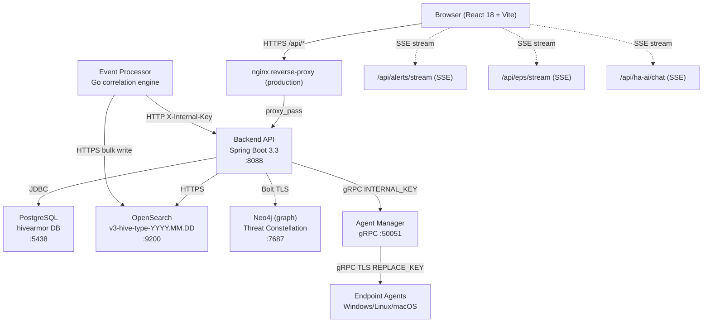

---

## 2. Frontend Module Diagram

Internal module structure of `frontend-v3/src/`. Dependency arrows flow downward — deeper modules must not import from higher modules.

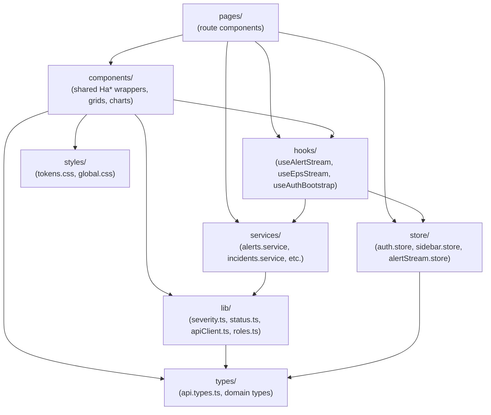

**Key rules:**
- `services/` must never be created inside `pages/` directories (audit found no violations)
- `lib/` has no upward imports — pure utility functions only
- `store/` must not import from `pages/` or `services/`

---

## 3. Route and Shell Composition Diagram

How `RouterProvider` → `AuthGuard` → `AppShell` → page component composes.

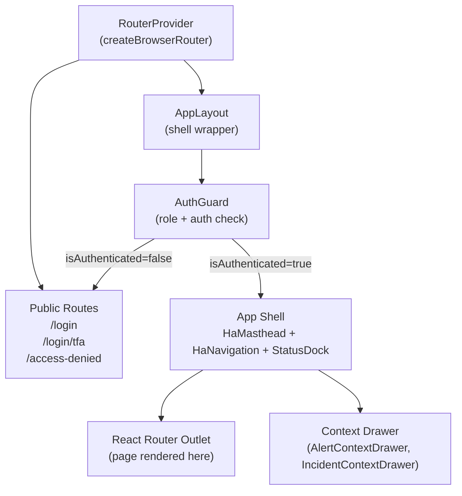

**Current gap:** `/access-denied` route has no `AuthGuard` (acceptable — intentional); 26 routes resolve to `.skip.ts` stubs with no user feedback.

---

## 4. API and Data Flow

Full request/response lifecycle from user interaction to data rendered in component.

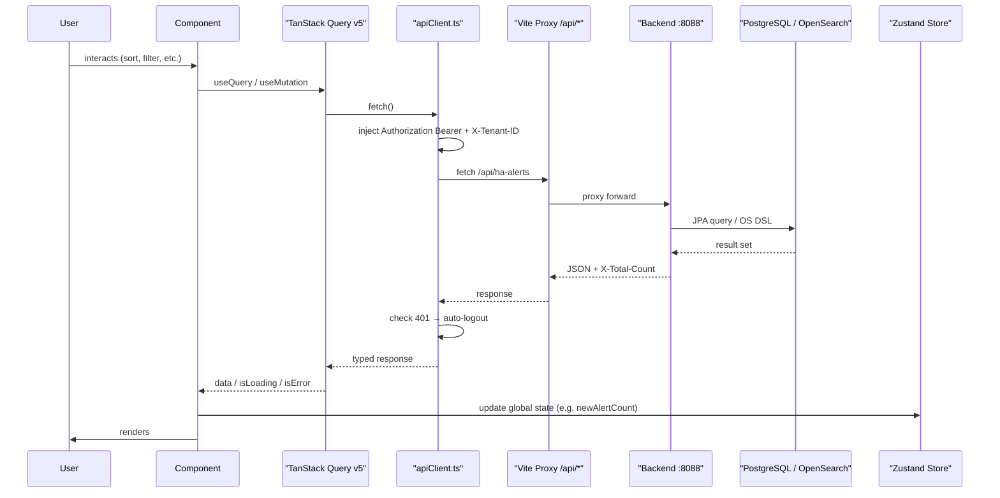

---

## 5. Authentication Flow

Login → JWT → localStorage → bootstrap → route guard.

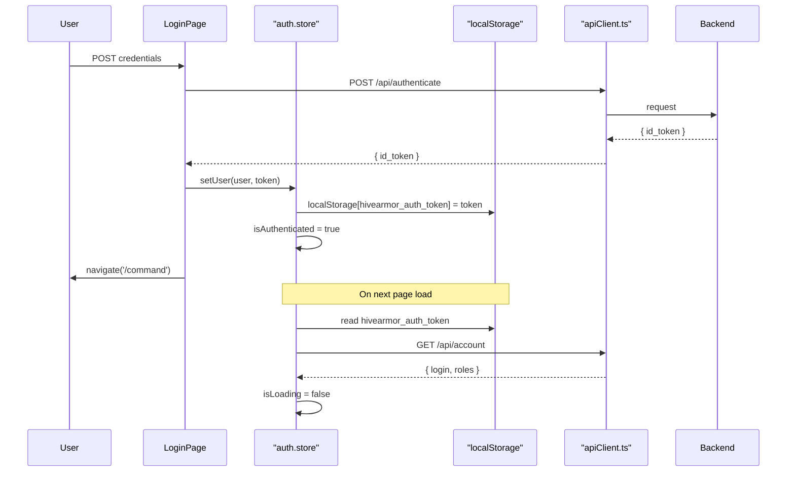

**DEBT-14 gap:** Backend regenerates JWT signing key on restart. All stored tokens become invalid. Fix: persist signing key in database or environment variable.

---

## 6. Tenant-Context Flow

Current state (header sent, not enforced) vs target state (full per-tenant isolation).

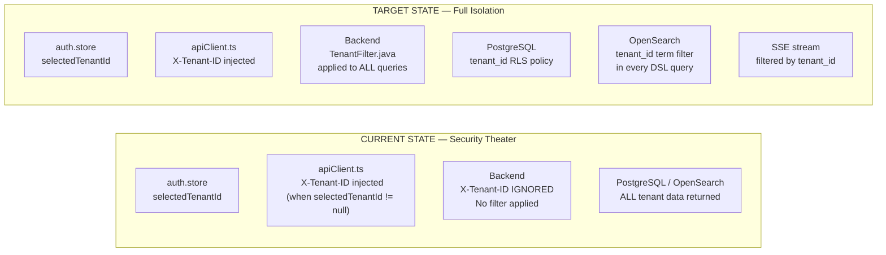

**Gap:** TENANT-01 through TENANT-07 — 6 missing implementations. Full MSSP work estimated at ~21 sessions (FS-01, FS-17).

---

## 7. Permission Flow

Roles → frontend guards → backend enforcement (current gaps annotated).

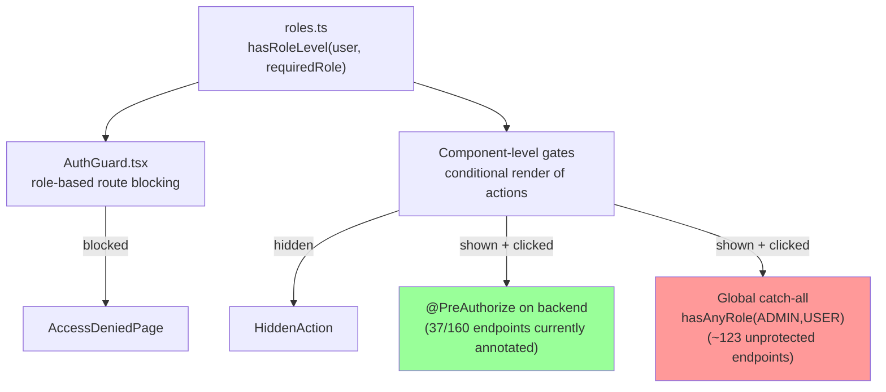

**Critical gaps:** BE-01, BE-02, BE-04, BE-05, BE-07, BE-12 — 6 endpoints fully unprotected with no `@PreAuthorize`. Any authenticated user can invoke these.

---

## 8. Real-Time Event Flow

SSE streams → Zustand stores → StatusDock + CommandCenterPage.

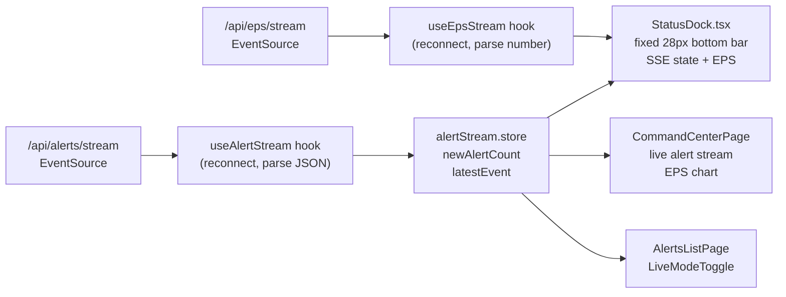

**Gap:** `EpsChart` in CommandCenterPage has `data=[]` hardcoded — EPS historical data not wired (FE-23). SSE connection auth: EventSource does not support custom headers; relies on cookie or URL param — current implementation must be audited for production auth.

---

## 9. Grid Adapter — SiemDataGrid Bridge

Current InfiniteRowModel workaround vs AG Grid Enterprise target.

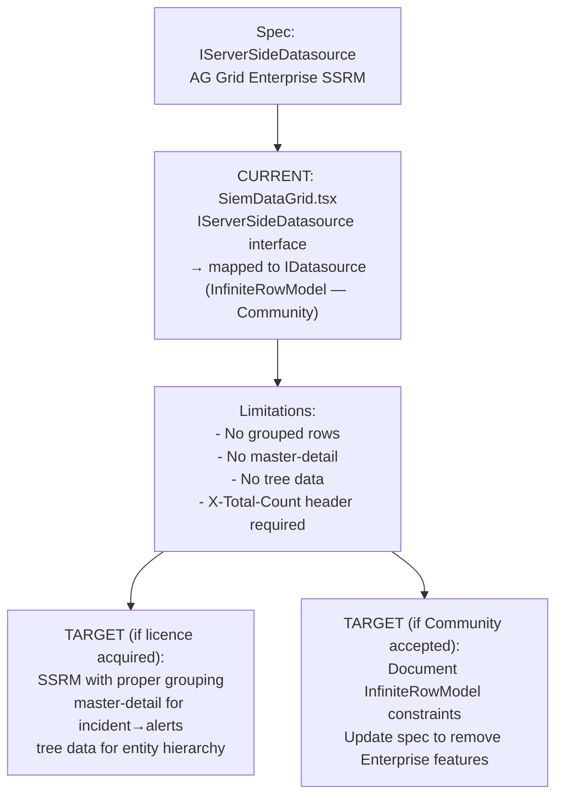

**Decision required:** DEC-01 — AG Grid Enterprise licence vs Community continuation. Blocking grouped views and master-detail expansion.

---

## 10. Dashboard Persistence Flow

GridStack layout → dashboards service → backend API.

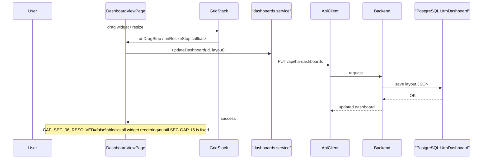

**Target gap:** `DashboardStudioPage` does not exist (CONTRADICTION-07). No draft/publish workflow exists (DASH-05).

---

## 11. Error-Handling Model

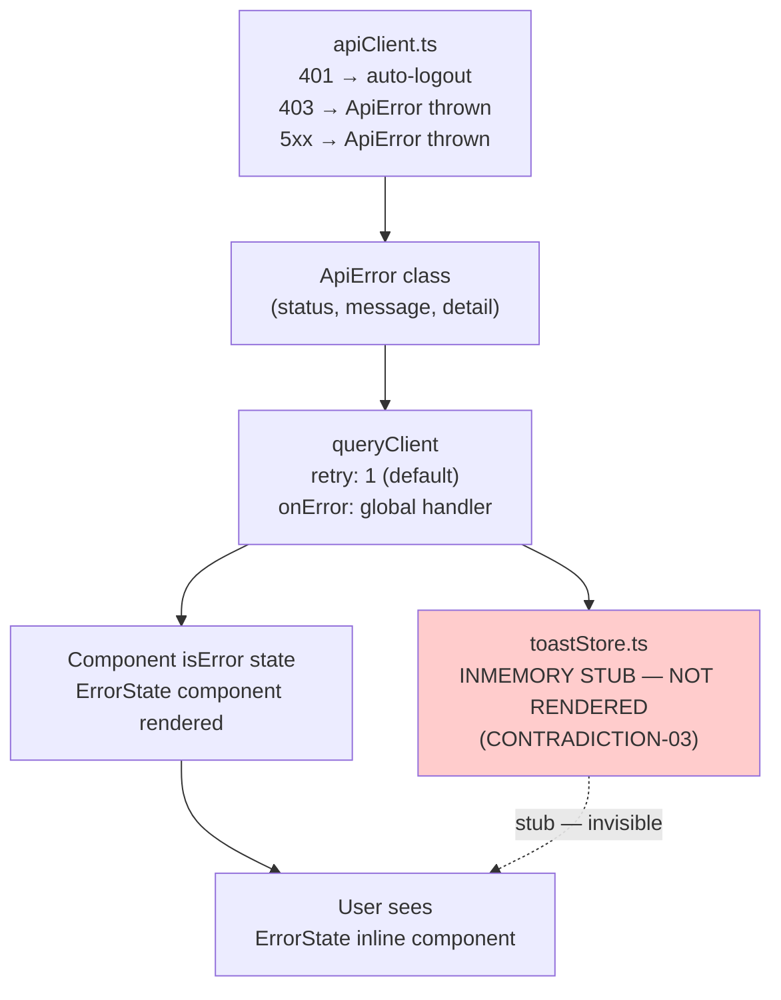

**Target state:** `<ToastStack>` mounted in `AppLayout.tsx`; `toastStore` connected to PatternFly `AlertGroup` for visible, accessible toast notifications.

---

## 12. State-Management Boundaries

| Data Type | Where It Lives | Justification |
|---|---|---|
| JWT token | `localStorage[hivearmor_auth_token]` | Survives page reload; single source of truth |
| Auth user + roles | `auth.store` (Zustand) | Global; needed everywhere |
| Selected tenant ID | `auth.store` (Zustand) | Global MSSP context |
| Alert list pages | TanStack Query cache | Server state; auto-invalidate on mutations |
| Incident list + detail | TanStack Query cache | Server state with staleTime |
| New alert count (SSE) | `alertStream.store` (Zustand) | Real-time; not server-state |
| Sidebar collapse state | `sidebar.store` (Zustand) | UI preference |
| Row density | `localStorage[ha_row_density]` | Persisted UX preference |
| Dashboard layout | TanStack Query cache (synced to backend) | Server state |
| Toast queue | `toastStore` (Zustand) — currently stub | Transient UI state |
| Investigation session | TanStack Query cache | Server state |
| Monaco editor content | Component state | Local; not persisted |

**Rule:** Never put server data in Zustand. Never put transient UI state in TanStack Query. Never put alert/incident payloads in localStorage.

---

## 13. Test Architecture

| Layer | Current | Target |
|---|---|---|
| Unit (lib, services) | Vitest + jsdom — 204 tests | Same, expand to 80%+ coverage |
| Component | Vitest + @testing-library/react | Add Storybook stories for all 20+ Ha* components |
| Integration | None | Vitest + MSW mock server for service/hook paths |
| E2E | None | Playwright — 5 critical journeys |
| Accessibility | None | axe-core in Vitest + Playwright |
| Visual regression | None | Chromatic (preferred) or Playwright screenshots |
| Performance | None | Lighthouse CI on every PR |
| Dead test discovery | None | CI check: `.skip.ts` files must have 0 `node:test` imports |

**Current gap:** 3 `.skip.ts` files use `node:test` (TI-01); no Storybook (TI-02); no Playwright (TI-03); no axe-core (TI-04); 0 of 550 golden screens (TI-05).

---

## 14. Deployment Boundary

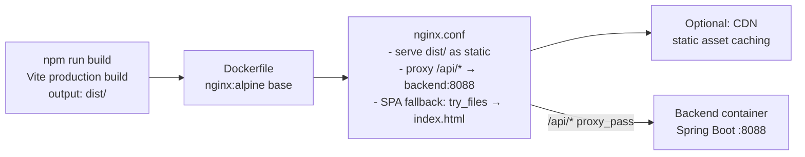

**Current bundle size:** 4.1 MB (all routes eagerly loaded — PERF-01). Target after route code splitting: initial load < 500 KB JS. Each lazy route chunk < 100 KB.

---

## Architecture Decision Points Required Before Implementation

| Decision | Impact | Blocking Horizon |
|---|---|---|
| DEC-01: AG Grid Enterprise licence | Grid grouping, master-detail | H2 |
| DEC-02: MSSP tenant architecture | All MSSP work | H6 |
| DEC-03: Persistent JWT key design | Auth reliability | H0 |
| DEC-07: Parser DSL language | Parser Intelligence | H5 |
| DEC-08: Neo4j schema definition | Threat Constellation | H3 |

Refer to document 22 for full decision register.
